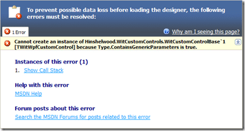

I have a little custom control I need added to my [Visual Studio Team System](http://msdn2.microsoft.com/en-us/teamsystem/default.aspx "Visual Studio Team System") projects. This control will allow specific groups of users as representatives of Advocacy groups with in the life cycle model to sign off a Requirement or Change Request from within Visual Studio.

But, just to make things a little more fun, I wanted to create the custom work item tracking control using WPF.

In order to do this you need a wrapper control that allows you to load any WPF control that inherits from IWorkItemControl.

Here is an example WPF Work Item Control:

\[[Get SignOffControl.xaml.vb source](http://www.codeplex.com/TFSWitWpfControls/SourceControl/FileView.aspx?itemId=35593&changeSetId=1459)\] \[[Get full source](http://www.codeplex.com/TFSWitWpfControls/SourceControl/DirectoryView.aspx?SourcePath=%24%2fTFSWitWpfControls&changeSetId=1459)\] \[[Get latest full source](http://www.codeplex.com/TFSWitWpfControls/SourceControl/ListDownloadableCommits.aspx)\]

```
   1: Imports Microsoft.TeamFoundation.WorkItemTracking.Client
```

```
   2: Imports Microsoft.TeamFoundation.WorkItemTracking.Controls
```

```
   3: 'Imports Microsoft.VisualStudio.TeamFoundation.WorkItemTracking
```

```
   4: 
```

```
   5: Namespace SignOff
```

```
   6: 
```

```
   7:     Partial Public Class SignOffControl
```

```
   8:         Implements IWorkItemControl
```

```
   9: 
```

```
  10: #Region " IWorkItemControl "
```

```
  11: 
```

```
  12:         Public Event AfterUpdateDatasource(ByVal sender As Object, ByVal e As System.EventArgs) Implements Microsoft.TeamFoundation.WorkItemTracking.Controls.IWorkItemControl.AfterUpdateDatasource
```

```
  13:         Public Event BeforeUpdateDatasource(ByVal sender As Object, ByVal e As System.EventArgs) Implements Microsoft.TeamFoundation.WorkItemTracking.Controls.IWorkItemControl.BeforeUpdateDatasource
```

```
  14: 
```

```
  15:         Protected m_serviceProvider As IServiceProvider = Nothing
```

```
  16:         Protected m_workItem As WorkItem = Nothing
```

```
  17:         Protected m_workItemFieldName As String = Nothing
```

```
  18:         Protected m_properties As System.Collections.Specialized.StringDictionary
```

```
  19: 
```

```
  20: 
```

```
  21:         Public Property [ReadOnly]() As Boolean Implements Microsoft.TeamFoundation.WorkItemTracking.Controls.IWorkItemControl.ReadOnly
```

```
  22:             Get
```

```
  23:                 Return Me.IsEnabled
```

```
  24:             End Get
```

```
  25:             Set(ByVal value As Boolean)
```

```
  26:                 Me.IsEnabled = value
```

```
  27:             End Set
```

```
  28:         End Property
```

```
  29: 
```

```
  30:         Public Sub SetSite(ByVal serviceProvider As System.IServiceProvider) Implements Microsoft.TeamFoundation.WorkItemTracking.Controls.IWorkItemControl.SetSite
```

```
  31:             m_serviceProvider = serviceProvider
```

```
  32:         End Sub
```

```
  33: 
```

```
  34:         Public Property WorkItemDatasource() As Object Implements Microsoft.TeamFoundation.WorkItemTracking.Controls.IWorkItemControl.WorkItemDatasource
```

```
  35:             Get
```

```
  36:                 Return m_workItem
```

```
  37:             End Get
```

```
  38:             Set(ByVal value As Object)
```

```
  39:                 If value Is Nothing And Not m_workItem Is Nothing Then
```

```
  40:                     RemoveHandler m_workItem.FieldChanged, AddressOf OnFieldChanged
```

```
  41:                 End If
```

```
  42:                 m_workItem = value
```

```
  43:                 If Not m_workItem Is Nothing Then
```

```
  44:                     AddHandler m_workItem.FieldChanged, New WorkItemFieldChangeEventHandler(AddressOf OnFieldChanged)
```

```
  45:                 End If
```

```
  46:             End Set
```

```
  47:         End Property
```

```
  48: 
```

```
  49:         Public Property WorkItemFieldName() As String Implements Microsoft.TeamFoundation.WorkItemTracking.Controls.IWorkItemControl.WorkItemFieldName
```

```
  50:             Get
```

```
  51:                 Return m_workItemFieldName
```

```
  52:             End Get
```

```
  53:             Set(ByVal value As String)
```

```
  54:                 m_workItemFieldName = value
```

```
  55:             End Set
```

```
  56:         End Property
```

```
  57: 
```

```
  58:         Public Property Properties() As System.Collections.Specialized.StringDictionary Implements Microsoft.TeamFoundation.WorkItemTracking.Controls.IWorkItemControl.Properties
```

```
  59:             Get
```

```
  60:                 Return m_properties
```

```
  61:             End Get
```

```
  62:             Set(ByVal value As System.Collections.Specialized.StringDictionary)
```

```
  63:                 m_properties = value
```

```
  64:             End Set
```

```
  65:         End Property
```

```
  66: 
```

```
  67:         Public Sub Clear() Implements Microsoft.TeamFoundation.WorkItemTracking.Controls.IWorkItemControl.Clear
```

```
  68: 
```

```
  69:         End Sub
```

```
  70: 
```

```
  71:         Public Sub FlushToDatasource() Implements Microsoft.TeamFoundation.WorkItemTracking.Controls.IWorkItemControl.FlushToDatasource
```

```
  72: 
```

```
  73:         End Sub
```

```
  74: 
```

```
  75:         Public Sub InvalidateDatasource() Implements Microsoft.TeamFoundation.WorkItemTracking.Controls.IWorkItemControl.InvalidateDatasource
```

```
  76: 
```

```
  77:         End Sub
```

```
  78: 
```

```
  79: #End Region
```

```
  80: 
```

```
  81: 
```

```
  82:         Protected Sub OnFieldChanged(ByVal sender As Object, ByVal e As WorkItemEventArgs)
```

```
  83: 
```

```
  84:         End Sub
```

```
  85: 
```

```
  86:     End Class
```

```
  87: 
```

```
  88: End Namespace
```

It does not yet do anything, but the base wrapper is there. The visual elements only contain a couple of button to get me started testing the wapper and to make sure that the control is displayed:

\[[Get SignOffControl.xaml source](http://www.codeplex.com/TFSWitWpfControls/SourceControl/FileView.aspx?itemId=35594&changeSetId=1459)\] \[[Get full source](http://www.codeplex.com/TFSWitWpfControls/SourceControl/DirectoryView.aspx?SourcePath=%24%2fTFSWitWpfControls&changeSetId=1459)\] \[[Get latest full source](http://www.codeplex.com/TFSWitWpfControls/SourceControl/ListDownloadableCommits.aspx)\]

```
   1: <UserControl x:Class="SignOff.SignOffControl"
```

```
   2:     xmlns="http://schemas.microsoft.com/winfx/2006/xaml/presentation"
```

```
   3:     xmlns:x="http://schemas.microsoft.com/winfx/2006/xaml" Width="317" Height="46">
```

```
   4:     <StackPanel>
```

```
   5:         <Button>SignOff</Button>
```

```
   6:         <Button>Clear</Button>
```

```
   7:     </StackPanel>
```

```
   8: </UserControl>
```

This will display 2 buttons, but does nothing.

[](http://blog.hinshelwood.com/files/2011/05/GWB-WindowsLiveWriter-CreatingaWPFWorkItemControl_914D-image_2.png)
{ .post-img }

You then need to create your wrapper control. This is a forms control that has the Element Host forms control to host the button. I have gone down the generic rout to minimise the amount of code I would use to create an individual “stub” when creating multiple controls.

here is an example “stub” which is created as a simple class:

\[[Get SignOffHostControl.vb source](http://www.codeplex.com/TFSWitWpfControls/SourceControl/FileView.aspx?itemId=35595&changeSetId=1459)\] \[[Get full source](http://www.codeplex.com/TFSWitWpfControls/SourceControl/DirectoryView.aspx?SourcePath=%24%2fTFSWitWpfControls&changeSetId=1459)\] \[[Get latest full source](http://www.codeplex.com/TFSWitWpfControls/SourceControl/ListDownloadableCommits.aspx)\]

```
   1: Namespace SignOff
```

```
   2: 
```

```
   3:     Public Class SignOffHostControl
```

```
   4:         Inherits WitCustomControlBase(Of SignOffControl)
```

```
   5: 
```

```
   6:     End Class
```

```
   7: 
```

```
   8: End Namespace
```

> _note: although this inherits from user control you will not be able to view it in the designer because of the generic nature of its inheritance. This is OK and does not hamper development._
>
> [](http://blog.hinshelwood.com/files/2011/05/GWB-WindowsLiveWriter-CreatingaWPFWorkItemControl_914D-image_4.png)[](http://blog.hinshelwood.com/files/2011/05/GWB-WindowsLiveWriter-CreatingaWPFWorkItemControl_914D-image_4.png)
> { .post-img }

All the heavy lifting for this control is done in the WitCustomControlBase and the generic type passed needs to meet the requirements of New, UIElement and IWorkItemControl. This ensures that it is a WPF control that inherits from IWorkItemControl.

To create this control you need to create a new Windows Forms control and call it WitCustomControlBase. Add a WPF “Element Host” to it and make that host dock to the total area.

Then we need to make the designer generic.

\[[Get WitCustomControlBase.Designer.vb source](http://www.codeplex.com/TFSWitWpfControls/SourceControl/FileView.aspx?itemId=35597&changeSetId=1459)\] \[[Get full source](http://www.codeplex.com/TFSWitWpfControls/SourceControl/DirectoryView.aspx?SourcePath=%24%2fTFSWitWpfControls&changeSetId=1459)\] \[[Get latest full source](http://www.codeplex.com/TFSWitWpfControls/SourceControl/ListDownloadableCommits.aspx)\]

```
   1: Imports Microsoft.TeamFoundation.WorkItemTracking.Client
```

```
   2: Imports Microsoft.TeamFoundation.WorkItemTracking.Controls
```

```
   3: 
```

```
   4: <Global.Microsoft.VisualBasic.CompilerServices.DesignerGenerated()> _
```

```
   5: Partial Class WitCustomControlBase(Of TWitWpfCustomControl As {New, UIElement, IWorkItemControl})
```

```
   6:     Inherits System.Windows.Forms.UserControl
```

```
   7: 
```

```
   8:     'UserControl overrides dispose to clean up the component list.
```

```
   9:     <System.Diagnostics.DebuggerNonUserCode()> _
```

```
  10:     Protected Overrides Sub Dispose(ByVal disposing As Boolean)
```

```
  11:         Try
```

```
  12:             If disposing AndAlso components IsNot Nothing Then
```

```
  13:                 components.Dispose()
```

```
  14:             End If
```

```
  15:         Finally
```

```
  16:             MyBase.Dispose(disposing)
```

```
  17:         End Try
```

```
  18:     End Sub
```

```
  19: 
```

```
  20:     'Required by the Windows Form Designer
```

```
  21:     Private components As System.ComponentModel.IContainer
```

```
  22: 
```

```
  23:     'NOTE: The following procedure is required by the Windows Form Designer
```

```
  24:     'It can be modified using the Windows Form Designer.
```

```
  25:     'Do not modify it using the code editor.
```

```
  26:     <System.Diagnostics.DebuggerStepThrough()> _
```

```
  27:     Private Sub InitializeComponent()
```

```
  28:         Me.uxElementHost = New System.Windows.Forms.Integration.ElementHost
```

```
  29:         Me.uxWitWpfCustomControl = New TWitWpfCustomControl
```

```
  30:         Me.SuspendLayout()
```

```
  31:         '
```

```
  32:         'uxElementHost1
```

```
  33:         '
```

```
  34:         Me.uxElementHost.Dock = System.Windows.Forms.DockStyle.Fill
```

```
  35:         Me.uxElementHost.Location = New System.Drawing.Point(0, 0)
```

```
  36:         Me.uxElementHost.Name = "uxElementHost"
```

```
  37:         Me.uxElementHost.Size = New System.Drawing.Size(222, 72)
```

```
  38:         Me.uxElementHost.TabIndex = 0
```

```
  39:         Me.uxElementHost.Text = "uxElementHost"
```

```
  40:         Me.uxElementHost.Child = Me.uxWitWpfCustomControl
```

```
  41:         '
```

```
  42:         'WitCustomHostCOntrol
```

```
  43:         '
```

```
  44:         Me.AutoScaleDimensions = New System.Drawing.SizeF(6.0!, 13.0!)
```

```
  45:         Me.AutoScaleMode = System.Windows.Forms.AutoScaleMode.Font
```

```
  46:         Me.Controls.Add(Me.uxElementHost)
```

```
  47:         Me.Name = "WitCustomHostCOntrol"
```

```
  48:         Me.Size = New System.Drawing.Size(222, 72)
```

```
  49:         Me.ResumeLayout(False)
```

```
  50: 
```

```
  51:     End Sub
```

```
  52:     Friend WithEvents uxElementHost As System.Windows.Forms.Integration.ElementHost
```

```
  53:     Friend WithEvents uxWitWpfCustomControl As TWitWpfCustomControl
```

```
  54: 
```

```
  55: End Class
```

As you can see the only changes that have been made are to the class to add the generic type (line 5) and to the type used on the control instance (lines 29, 53).

> note: Once you have made these and the following changes to the designer, you will no longer be able to view the designer in VS because we have made modifications for the designer.
>
> [](http://blog.hinshelwood.com/files/2011/05/GWB-WindowsLiveWriter-CreatingaWPFWorkItemControl_914D-image_6.png)[](http://blog.hinshelwood.com/files/2011/05/GWB-WindowsLiveWriter-CreatingaWPFWorkItemControl_914D-image_6.png)
> { .post-img }

Now we have changed the designer, we need to move on to the main control code and change it to pass all calls and implementation of the IWorkItemControl interface to the WPF control.

\[[Get WitCustomControlBase.vb source](http://www.codeplex.com/TFSWitWpfControls/SourceControl/FileView.aspx?itemId=35599&changeSetId=1459)\] \[[Get full source](http://www.codeplex.com/TFSWitWpfControls/SourceControl/DirectoryView.aspx?SourcePath=%24%2fTFSWitWpfControls&changeSetId=1459)\] \[[Get latest full source](http://www.codeplex.com/TFSWitWpfControls/SourceControl/ListDownloadableCommits.aspx)\]

```
   1: Imports Microsoft.TeamFoundation.WorkItemTracking.Client
```

```
   2: Imports Microsoft.TeamFoundation.WorkItemTracking.Controls
```

```
   3: 'Imports Microsoft.VisualStudio.TeamFoundation.WorkItemTracking
```

```
   4: 
```

```
   5: 
```

```
   6: Public Class WitCustomControlBase(Of TWitWpfCustomControl As {New, UIElement, IWorkItemControl})
```

```
   7:     Implements IWorkItemControl
```

```
   8: 
```

```
   9: #Region " IWorkItemControl "
```

```
  10: 
```

```
  11:     Public Event AfterUpdateDatasource(ByVal sender As Object, ByVal e As System.EventArgs) Implements Microsoft.TeamFoundation.WorkItemTracking.Controls.IWorkItemControl.AfterUpdateDatasource
```

```
  12:     Public Event BeforeUpdateDatasource(ByVal sender As Object, ByVal e As System.EventArgs) Implements Microsoft.TeamFoundation.WorkItemTracking.Controls.IWorkItemControl.BeforeUpdateDatasource
```

```
  13: 
```

```
  14:     Public Property [ReadOnly]() As Boolean Implements Microsoft.TeamFoundation.WorkItemTracking.Controls.IWorkItemControl.ReadOnly
```

```
  15:         Get
```

```
  16:             Return Me.uxWitWpfCustomControl.[ReadOnly]
```

```
  17:         End Get
```

```
  18:         Set(ByVal value As Boolean)
```

```
  19:             Me.uxWitWpfCustomControl.[ReadOnly] = value
```

```
  20:         End Set
```

```
  21:     End Property
```

```
  22: 
```

```
  23:     Public Sub SetSite(ByVal serviceProvider As System.IServiceProvider) Implements Microsoft.TeamFoundation.WorkItemTracking.Controls.IWorkItemControl.SetSite
```

```
  24:         Me.uxWitWpfCustomControl.SetSite(serviceProvider)
```

```
  25:     End Sub
```

```
  26: 
```

```
  27:     Public Property WorkItemDatasource() As Object Implements Microsoft.TeamFoundation.WorkItemTracking.Controls.IWorkItemControl.WorkItemDatasource
```

```
  28:         Get
```

```
  29:             Return Me.uxWitWpfCustomControl.WorkItemDatasource
```

```
  30:         End Get
```

```
  31:         Set(ByVal value As Object)
```

```
  32:             Me.uxWitWpfCustomControl.WorkItemDatasource = value
```

```
  33:         End Set
```

```
  34:     End Property
```

```
  35: 
```

```
  36:     Public Property WorkItemFieldName() As String Implements Microsoft.TeamFoundation.WorkItemTracking.Controls.IWorkItemControl.WorkItemFieldName
```

```
  37:         Get
```

```
  38:             Return Me.uxWitWpfCustomControl.WorkItemFieldName
```

```
  39:         End Get
```

```
  40:         Set(ByVal value As String)
```

```
  41:             Me.uxWitWpfCustomControl.WorkItemFieldName = value
```

```
  42:         End Set
```

```
  43:     End Property
```

```
  44: 
```

```
  45:     Public Property Properties() As System.Collections.Specialized.StringDictionary Implements Microsoft.TeamFoundation.WorkItemTracking.Controls.IWorkItemControl.Properties
```

```
  46:         Get
```

```
  47:             Return Me.uxWitWpfCustomControl.Properties
```

```
  48:         End Get
```

```
  49:         Set(ByVal value As System.Collections.Specialized.StringDictionary)
```

```
  50:             Me.uxWitWpfCustomControl.Properties = value
```

```
  51:         End Set
```

```
  52:     End Property
```

```
  53: 
```

```
  54:     Public Sub Clear() Implements Microsoft.TeamFoundation.WorkItemTracking.Controls.IWorkItemControl.Clear
```

```
  55:         Me.uxWitWpfCustomControl.Clear()
```

```
  56:     End Sub
```

```
  57: 
```

```
  58:     Public Sub FlushToDatasource() Implements Microsoft.TeamFoundation.WorkItemTracking.Controls.IWorkItemControl.FlushToDatasource
```

```
  59:         Me.uxWitWpfCustomControl.FlushToDatasource()
```

```
  60:     End Sub
```

```
  61: 
```

```
  62:     Public Sub InvalidateDatasource() Implements Microsoft.TeamFoundation.WorkItemTracking.Controls.IWorkItemControl.InvalidateDatasource
```

```
  63:         Me.uxWitWpfCustomControl.InvalidateDatasource()
```

```
  64:     End Sub
```

```
  65: 
```

```
  66: #End Region
```

```
  67: 
```

```
  68:     Private Sub uxWitCustomControl_AfterUpdateDatasource(ByVal sender As Object, ByVal e As System.EventArgs) Handles uxWitWpfCustomControl.AfterUpdateDatasource
```

```
  69:         RaiseEvent AfterUpdateDatasource(sender, e)
```

```
  70:     End Sub
```

```
  71: 
```

```
  72:     Private Sub uxWitCustomControl_BeforeUpdateDatasource(ByVal sender As Object, ByVal e As System.EventArgs) Handles uxWitWpfCustomControl.BeforeUpdateDatasource
```

```
  73:         RaiseEvent BeforeUpdateDatasource(sender, e)
```

```
  74:     End Sub
```

```
  75: 
```

```
  76: End Class
```

This control implements the IWorkItemControl and it is the control that Work Item Tracking loads. Work Item Tracking form display module does not know anything about WPF and we are just faking up the interface to allow us to use the full functionality on WPF in place of Windows Forms. We can use the same method to implement the other features like IWorkItemUserAction.

We then need a Work Item Custom Control (WICC) definition file.

\[[Get SignOffControl.wicc source](http://www.codeplex.com/TFSWitWpfControls/SourceControl/FileView.aspx?itemId=35596&changeSetId=1459)\] \[[Get full source](http://www.codeplex.com/TFSWitWpfControls/SourceControl/DirectoryView.aspx?SourcePath=%24%2fTFSWitWpfControls&changeSetId=1459)\] \[[Get latest full source](http://www.codeplex.com/TFSWitWpfControls/SourceControl/ListDownloadableCommits.aspx)\]

```
   1: <?xml version="1.0"?>
```

```
   2: <CustomControl xmlns:xsi="http://www.w3.org/2001/XMLSchema-instance" xmlns:xsd="http://www.w3.org/2001/XMLSchema">
```

```
   3:  <Assembly>Hinshelwood.WitCustomControls.dll</Assembly>
```

```
   4:  <FullClassName>Hinshelwood.WitCustomControls.SignOff.SignOffHostControl</FullClassName>
```

```
   5: </CustomControl>
```

This is the file that tells Visual Studio what to do.

This file and the .dll need to copied to the …Application DataMicrosoftTeam FoundationWork Item TrackingCustom Controls9.0 folder.

We can now add this control to a work item by modifying the XML definition of a Work item. To test I have just replaced an existing control.

You can add this using the Power Tools process template editor.

[](http://blog.hinshelwood.com/files/2011/05/GWB-WindowsLiveWriter-CreatingaWPFWorkItemControl_914D-image_10.png)
{ .post-img }

The result?

[](http://blog.hinshelwood.com/files/2011/05/GWB-WindowsLiveWriter-CreatingaWPFWorkItemControl_914D-image_8.png)
{ .post-img }

You will notice that this control is marked as read-only, but not bad for a first pass…

Technorati Tags: [ALM](http://technorati.com/tags/ALM) [WPF](http://technorati.com/tags/WPF) [CodeProject](http://technorati.com/tags/CodeProject) [TFS](http://technorati.com/tags/TFS)
