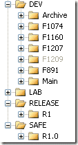

I know that I have not been posting in a while, and I hope to remedy that. I have been working on getting our internal team up to speed on using [TFS](http://msdn2.microsoft.com/en-us/teamsystem/aa718934.aspx "Team Foundation Server") as a full ALM tool and not just for source control. I am getting a lot of resistance on creating work items ( as this is a PM’s job !) but we are making progress.
{ .post-img }

I was off for the last couple of days and came back to a WTF moment. I noticed, upon opening my source control, that there were two “Main” folders. “Main” and “MainPreR1”.

WTF?

Upon enquiring it turns out that a change had been made to “R1” (legitimate) to fix a Bug (loose definition, but a definition none the less). Then the “Main” folder had been renamed and a new “Main” folder branched from “R1” and 2 new Features branched from that, leaving all the other existing branches to fend for themselves.

WTFx2!

If you are not sure what I mean, then let me explain. In order to merge from “F1207” into “Main” you would need to first merge it with “MainPreR1”, then merge it with “R1”, then merge it into “Main”. And thus you have just contaminated “R1” with something that is not in “R1” but should be in “R2”. On top of this the other orphaned features can’t take advantage of new features in “R2” without contaminating “R1”… messy.

As you can see from the screenshot on the right it is now under control, but it took the perpetrator the better part of the morning to get it sorted, and the are still putting the finishing touches to it (It is a good thing the do not let us have guns here in the UK). If you are interested, here are the steps that were performed to sort out this problem.

1. **Zip all content in  “Fxx1” and “Fxx2”.** _To safeguard the dev work._
2. **Delete branch “Fxx1” and “Fxx2” from source control**
3. **Check in everything…**
4. **Delete “Main” from source control.** _coz it is the crap one_
5. **Check in everything**
6. **Rename “MainPreR1” to “Main”.** _Which is the way it should have been._
7. **Check In Everything…** _Now we are back where we started._
8. **Merge “R1” into “Main”.** _This is the action that should have occurred in the first place._
9. **Check in everything…**
10. **Create Branches for “Fxx1” and “Fxx1”**
11. **Check in everything…**
12. **Check out “Fxx1” and “Fxx1”.**
13. **Copy archived “Fxx1” and “Fxx2” over the top of new branch.**
14. **Check in everything…**

A long way for a short cut :)

Well, at least the lesson is learned…

Technorati Tags: [ALM](http://technorati.com/tags/ALM)
