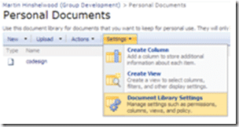
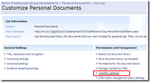
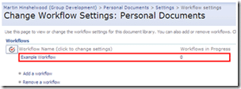
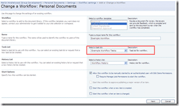
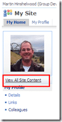
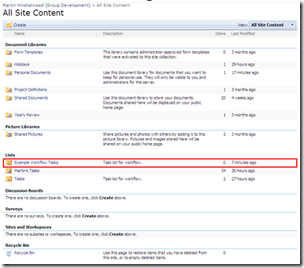
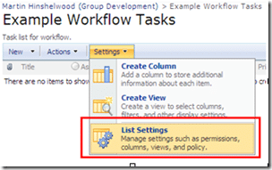
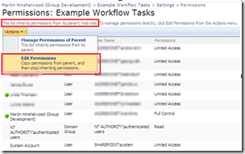
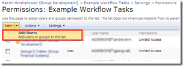

If you want to be able to use workflow on you're my site that will allow you to assign tasks to your colleagues, then you need to take a couple of thing into consideration. The most important is to give any users assigned tasks access to the tasks list that you are using for your workflow.

You will need to think hard about wither the workflow you are considering would be better as part of your team's site, or as part of another site in the Sharepoint farm as adding permission to other people on your MySite is a security risk. But the benefit may well be worth the risk.

What we will be doing is adding any users you will be assigning workflow to the "Contributors" group so they will be able to delete tasks.

When you setup your workflow you will be asked what task list you want to use for it. If you selected "New Task List" the system will create a task list of the name "\[Workflow Name\] Tasks".

{ .post-img }

You will need to give users permission to this Task list, but you could have multiple task lists to allow more refined permission for different workflows.

{ .post-img }

## Finding the task list name

First you need to find the Task list. If you have already setup the workflow, the changes are that you have used the default, which is "Tasks". You can check by going to the list or document library that has the workflow and click the "Settings" tab and then the "Manage" option.

{ .post-img }

You will then be presented with all of the options for your list or library. The option you are looking for is the "Workflow Settings" option under "Permissions and Management".

{ .post-img }

This will take you to a list of all of the workflows that are currently setup (or the create workflow page if there are none) where you need to select the workflow that you want.

{ .post-img }

This will take you to the change a workflow page and you will be able to see the name of the task list, in this case "Example Workflow Tasks".

{ .post-img }

Now we have that information we need to return to the top level of your MySite to set the permissions on your Task List.

{ .post-img }

## Setting the permissions on a Task list

Now we know the name of the task list we can set the permission on the correct list. Click on the "View All Site Content" button to see a list of all the bits and bobs that have already been created.

{ .post-img }

Under the "Lists" Heading you will see the "Example Workflow Tasks" list which is not displayed by default on the left navigation of your MySite homepage. If you click the name you will be taken directly to the list so we can edit the permissions.

{ .post-img }

As before we will need to get to the lists options, so click the "List Settings".

{ .post-img }

And again under "Permissions and Management" select "Permissions for this list".

{ .post-img }

By default all lists created use the same permissions as the parent site. We need to override this so we can set specific permission for our workflow tasks. To enable specific permissions we click the "Edit Permissions" button which makes a copy of the existing permissions and detached the list's permission from your MySite. You will get a warning box to make you aware of this and that any changes to the top level site will no longer affect the permissions of this list.

{ .post-img }

You now have the option to delete, edit and add users to **_this list only_** as you would on any site. Add the users who you will be assigning workflow tasks to and delete any others that you do not want access.

{ .post-img }

Make sure that you have the correct users listed in the "Users/Groups" box and that you only have the "Contribute" permission enabled. Then decide wither to send people an email to let them know that they now have access.

{ .post-img }

Easy J

Technorati Tags: [MOSS](http://technorati.com/tags/MOSS) [SP 2007](http://technorati.com/tags/SP+2007) [Answers](http://technorati.com/tags/Answers) [SharePoint](http://technorati.com/tags/SharePoint)
