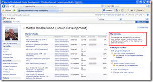
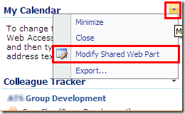
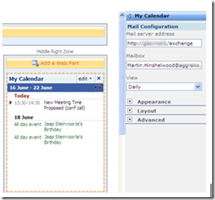

I thought I should explain how to enable the "My Calendar" web part on you're my Site (homepage). Here is my "MySite", as you can see I have a horrible picture, but if you check out the red rectangle you will see the "My Calendar" control has already been added to your site.

{ .post-img }

To configure this and any other web parts you need to hit the little down arrow below and then select "Modify Shared Web Part" to enter edit mode for that web part.

{ .post-img }

Your page will now be in edit mode denoted by the "Exit Edit Mode" button that appears under the "Site Actions" navigation and the addition of the "Add a web part" and Zone boxes that appears. To configure the "My Calendar" web part you will see the panel on the right has the same heading as the web part that we just opted to modify. You should now see the "Mail Configuration" section with a blank box under "Mail server address" and your email filled out under "Mailbox". To enable the calendar you need to put in the address of the Outlook Web Access server. This is "http://\[servername\]/exchange".

 
{ .post-img }

Once you have filled out the "Mail server address" you need to click "Apply" at the bottom of the page to make the change.

{ .post-img }

Your calendar items will now be displayed on the page.

You can add other Outlook Web Access features to your page including "My Contacts" or "My Tasks" and the much more useful "My Email" which can all be configured in the same way.

Technorati Tags: [MOSS](http://technorati.com/tags/MOSS) [SP 2007](http://technorati.com/tags/SP+2007) [Answers](http://technorati.com/tags/Answers) [SharePoint](http://technorati.com/tags/SharePoint)
