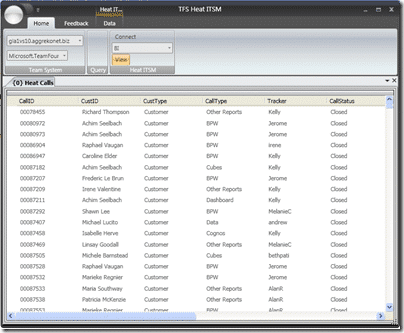

I will be working on some new features to the Sticky Buddy application. Improvements in the interface, along with a more modular structure and more diagram offering are in the mix. I have been working on some of the enhancements and their implementation in my other lesser known project [TFS Heat ITSM](http://hinshelwood.com/TFSHeatITSM.aspx)…

{ .post-img }

As you can see, a new look and feel for a new version, but this should allow me to implement a better modular design and separate out

the individual bits and pieces.

Head over to [Codeplex](http://codeplex.com) and vote for your favourite feature, ort add a new one :)

[Issue Tracker](http://www.codeplex.com/TFSStickyBuddy/WorkItem/List.aspx "Issue Tracker")

Technorati Tags: [WPF](http://technorati.com/tags/WPF) [ALM](http://technorati.com/tags/ALM) [WIT](http://technorati.com/tags/WIT)
