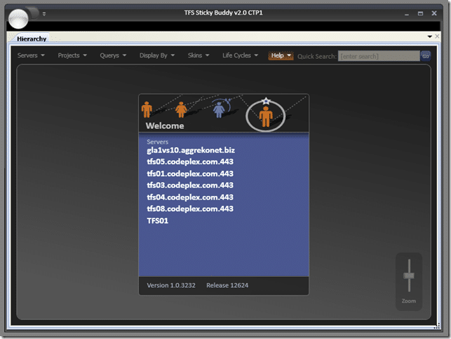

Lets just say that it will be a while in development. I am trying to implement the Composite Application blocks for WPF from Microsoft in an attempt to make the application more modular. I will be updating and [releasing under the v2.0 CTP](http://hinshelwood.com/downloads/TFSStickyBuddy/v2.0/) version and I have uploaded the installation files. This is a [ClickOnce application](http://hinshelwood.com/downloads/TFSStickyBuddy/v2.0/Hinshelwood.TFSStickyBuddy.application), so you will always have the latest version of the CTP.

{ .post-img }

The current version CTP1 has only those changes to allow for the new Navigation and structure options, but More features are on the way.

 

Technorati Tags: [.NET](http://technorati.com/tags/.NET) [WPF](http://technorati.com/tags/WPF) [WIT](http://technorati.com/tags/WIT) [ALM](http://technorati.com/tags/ALM)

