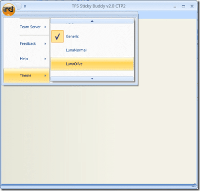

If, like me, you like to have changeable resource files in your application. Wither it is for changing the Theme, or interchanging templates you will need to take special care when using the

[](http://www.codeplex.com/CompositeWPF)libraries.

The new version of the [TFS Sticky Buddy](http://hinshelwood.com/TFSStickyBuddy.aspx) uses both!

[](http://blog.hinshelwood.com/files/2011/05/GWB-WindowsLiveWriter-CompositeWPFandMergedDictionaries_9AD7-image_2.png)
{ .post-img }

I am using the built in Infragistics theme system, and the first time you select a theme I am just adding a resource file that overrides the default:

```
   1: Dim resourceDictionary As ResourceDictionary = ThemeManager.GetResourceSet(theme, ThemeManager.AllGroupingsLiteral)
```

```
   2: If Not resourceDictionary Is Nothing Then
```

```
   3:    Application.Current.Resources.MergedDictionaries.Add(resourceDictionary)
```

```
   4: End If
```

 

This causes an error in the ItemsControlRegionAdapter as WPF seams to redo the region adapters and you get a ItemsControlHasItemsSourceException. You need to change the code to the following (notice the commented out areas):

```
   1: /// <summary>
```

```
   2: /// Adapts an <see cref="ItemsControl"/> to an <see cref="IRegion"/>.
```

```
   3: /// </summary>
```

```
   4: /// <param name="region">The new region being used.</param>
```

```
   5: /// <param name="regionTarget">The object to adapt.</param>
```

```
   6: protected override void Adapt(IRegion region, ItemsControl regionTarget)
```

```
   7: {  //Modified by Martin Hinshelwood to allow resource file changes...
```

```
   8:     //if (regionTarget.ItemsSource != null || (BindingOperations.GetBinding(regionTarget, ItemsControl.ItemsSourceProperty) != null))
```

```
   9:     //    throw new InvalidOperationException(Resources.ItemsControlHasItemsSourceException);
```

```
  10:
```

```
  11:     //If control has child items, move them to the region and then bind control to region. Can't set ItemsSource if child items exist.
```

```
  12:     if (regionTarget.Items.Count > 0)
```

```
  13:     {
```

```
  14:         foreach (object childItem in regionTarget.Items)
```

```
  15:         {
```

```
  16:             region.Add(childItem);
```

```
  17:         }
```

```
  18:         //Control must be empty before setting ItemsSource
```

```
  19:         regionTarget.ItemsSource = null;
```

```
  20:         //regionTarget.Items.Clear();
```

```
  21:     }
```

```
  22:     regionTarget.ItemsSource = region.Views;
```

```
  23: }
```

 

You will notice that I had to comment out the exception for existing controls as well as the Items.Clear (which is replaced by setting the ItemsSource to nothing). This solves the problem I I have not noticed any adverse reactions.

The second problem occurs when you do you second set of the theme. at this point you need to remove the existing theme:

```
   1: If Not m_CurrentTheme Is Nothing Then
```

```
   2:       Application.Current.Resources.MergedDictionaries.Remove(m_CurrentTheme)
```

```
   3: End If
```

 

When this happens the region management is redone and you get a further RegionNameExistsException from the RegionManager. Then can be solved by changing the code in the AttachNewRegion method:

```
   1: /// <summary>
```

```
   2: /// Attaches a region to an object and adds it to the region manager.
```

```
   3: /// </summary>
```

```
   4: /// <param name="regionTarget">The object to adapt. This is typically a container (i.e a control).</param>
```

```
   5: /// <param name="regionName">The name of the region to register.</param>
```

```
   6: /// <exception cref="ArgumentException">When regions collection already has a region registered using <paramref name="regionName"/>.</exception>
```

```
   7: public void AttachNewRegion(object regionTarget, string regionName)
```

```
   8: {  //Modified by Martin Hinshelwood to allow resource file changes...
```

```
   9:     if (Regions.ContainsKey(regionName))
```

```
  10:         return; //throw new ArgumentException(string.Format(CultureInfo.InvariantCulture, Resources.RegionNameExistsException, regionName));
```

```
  11:
```

```
  12:     IRegionAdapter regionAdapter = regionAdapterMappings.GetMapping(regionTarget.GetType());
```

```
  13:     IRegion region = regionAdapter.Initialize(regionTarget);
```

```
  14:
```

```
  15:     Regions.Add(regionName, region);
```

```
  16: }
```

 

So instead of bombing out when you try to add a region of the same name, it will just ignore it. Not ideal, but necessary.

 

Technorati Tags: [WPF](http://technorati.com/tags/WPF) [ALM](http://technorati.com/tags/ALM) [TFS Custom](http://technorati.com/tags/TFS+Custom) [WIT](http://technorati.com/tags/WIT)


