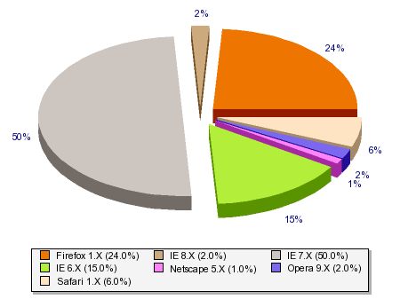
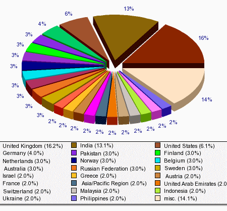

Well, that's me got passed the [100,000 Visits milestone](http://www.sitemeter.com/?a=stats&s=s41hinshelm). I guess it is seams bigger than it is, but as the next big one would be a million I am chuffed to get this far :)

\-- Site Summary ---                      
Visits

Total ...................... 101,421             
   Average per Day ................ 319             
   Average Visit Length .......... 1:10             
   This Week .................... 2,231

Page Views

Total ...................... 134,216             
   Average per Day ................ 410             
   Average per Visit .............. 1.3             
   This Week .................... 2,873

I always like to look at the browser share, and yes, I know that my site is not indicative of the internet in general but it is still interesting.

{ .post-img }

Looks like IE7 is winning the day :)

But is is the Countries that shows how…”cosmopolitan”… your site is:

{ .post-img }

Non to shabby for a wee developer in Glasgow, Scotland :)

Technorati Tags: [Personal](http://technorati.com/tags/Personal) [Answers](http://technorati.com/tags/Answers)
