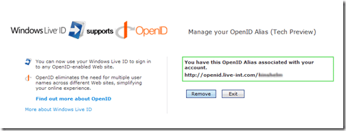
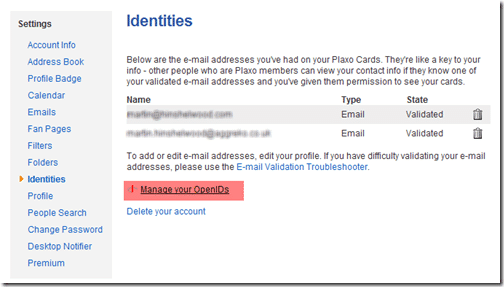

It seams that Microsoft is making an attempt to integrate with OpenID. With the announcement that “[Windows Live ID commits to support of OpenID](http://winliveid.spaces.live.com/Blog/cns!AEE1BB0D86E23AAC!1745.entry)” I thought a little investigation would be in order.

You need to setup a new Live ID on the Live-INT service, you can use any email, but make sure that you do not use your production password!

- Go to [https://login.live-INT.com/](https://login.live-INT.com/) and use the sign-up button to set up a Windows Live ID test account in the INT environment.
- Go to [https://login.live-int.com/beta/ManageOpenID.srf](https://login.live-int.com/beta/ManageOpenID.srf) to set up your OpenID test alias.
  
  { .post-img }
  You alias will be “http://openid.live-int.com/\[yourAlias\].

      You can then associate an open ID with a site. Here is the experience with Plaxo:

      

  { .post-img }
  From the Plaxo homepage, click “Settings”…

      

  { .post-img }
  Then select “Identities” and “Manage your OpenID’s”.

      

  { .post-img }
  You can then attach any number of OpenIDs to your Plaxo account. So lets click “Attach a new OpenID”.

      

  { .post-img }
  And then “SignIn”.

      

  { .post-img }
  This is where Windows Live takes over from the main sites, and you enter your password for your Live account.

      I am hoping that they will be releasing a version that works for .NET applications and not just websites. This would allow application developers to join the ranks of interconnected authentication application with single sign-on.

      It is a dream I have…

      Technorati Tags: [Windows Live](http://technorati.com/tags/Windows+Live),[OpenID](http://technorati.com/tags/OpenID)
