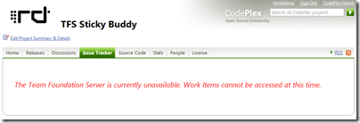

{ .post-img }

Here I am slogging my guts out, trying to get [TFS Sticky Buddy](http://hinshelwood.com/TFSStickyBuddy.aspx) v2.0 out the door and bang goes the [TFS](http://msdn2.microsoft.com/en-us/teamsystem/aa718934.aspx "Team Foundation Server") server :(

 
{ .post-img }

This is tfs05 on the [Codeplex](http://codeplex.com) environment. All the others seem to be running OK, but juts my luck the one I am using is the one that is affected, and nothing on the [Outage page](http://www.codeplex.com/CodePlex/Wiki/View.aspx?title=System%20Outage%20Report)! its been 3 hours and nothing. I have emailed them and reported it on the [Discussions](http://www.codeplex.com/CodePlex/Thread/View.aspx?ThreadId=40346) page.

{ .post-img }

Now, although I am, I am not really complaining as they have provided a fantastic service over the last, what… two years!

Hats off to the [CodePlex](http://www.codeplex.com "CodePlex") team, but get the bloody server fixed so I can check in my code!

Technorati Tags: [ALM](http://technorati.com/tags/ALM) [WIT](http://technorati.com/tags/WIT) [TFS](http://technorati.com/tags/TFS)
