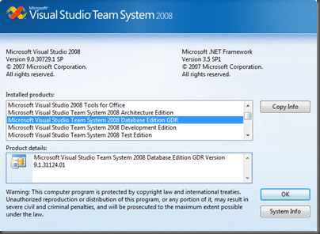
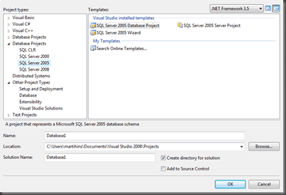

First, download the new Data Dude.

> **Download page**  
> [http://www.microsoft.com/downloads/details.aspx?FamilyID=bb3ad767-5f69-4db9-b1c9-8f55759846ed&displaylang=en](http://www.microsoft.com/downloads/details.aspx?FamilyID=bb3ad767-5f69-4db9-b1c9-8f55759846ed&displaylang=en)  
> **Setup**  
> [http://download.microsoft.com/download/0/a/e/0ae1153a-8798-474a-93e6-d19299f37c8b/setup.exe](http://download.microsoft.com/download/0/a/e/0ae1153a-8798-474a-93e6-d19299f37c8b/setup.exe)
>
> - **Read Me**  
>    [http://download.microsoft.com/download/0/a/e/0ae1153a-8798-474a-93e6-d19299f37c8b/Readme.mht](http://download.microsoft.com/download/0/a/e/0ae1153a-8798-474a-93e6-d19299f37c8b/Readme.mht)
> - **Documentation:**  
>    [http://download.microsoft.com/download/0/a/e/0ae1153a-8798-474a-93e6-d19299f37c8b/Documentation.zip](http://download.microsoft.com/download/0/a/e/0ae1153a-8798-474a-93e6-d19299f37c8b/Documentation.zip)

Once you get it going the install is pretty easy. Things to watch out for are:

- Remove all previous versions before the install. This included any CTP or RC versions.
- You will NOT be able to upgrade your projects built with the CTP releases! You should however be able to upgrade any projects built with the RC.

> ### Installation
>
> #### Uninstall old GDR versions
>
> If you have a previous version of the GDR installed, you will have to uninstall these first. You can do this via Add/Remove Programs or from the command line using:
>
> · msiexec /X {DDF197C6-4507-3A19-A4B5-0E17CC931370}
>
> #### Prerequisites
>
> Before you start downloading and installing please check if the following pre-requisites are present on your machine!
>
> - [Visual Studio 2008 SP1 RTM](http://www.microsoft.com/downloads/details.aspx?FamilyId=FBEE1648-7106-44A7-9649-6D9F6D58056E&displaylang=en) (make sure this is the RTM not the beta of SP1, the GDR will not install with the beta release of SP1)
> - [Microsoft SQL Server Compact Edition 3.5 SP1](http://www.microsoft.com/downloads/details.aspx?FamilyID=dc614aee-7e1c-4881-9c32-3a6ce53384d9&displaylang=en) (this is normally included in the setup of VS 2008 SP1)
>
> #### Installation
>
> You can download the [Visual Studio Team System 2008 Database Edition GDR](http://www.microsoft.com/downloads/details.aspx?FamilyID=bb3ad767-5f69-4db9-b1c9-8f55759846ed&displaylang=en) from the following location:
>
> - Setup  
>    [http://download.microsoft.com/download/0/a/e/0ae1153a-8798-474a-93e6-d19299f37c8b/setup.exe](http://download.microsoft.com/download/0/a/e/0ae1153a-8798-474a-93e6-d19299f37c8b/setup.exe)
> - Read Me  
>    [http://download.microsoft.com/download/0/a/e/0ae1153a-8798-474a-93e6-d19299f37c8b/Readme.mht](http://download.microsoft.com/download/0/a/e/0ae1153a-8798-474a-93e6-d19299f37c8b/Readme.mht)
> - Documentation:  
>    [http://download.microsoft.com/download/0/a/e/0ae1153a-8798-474a-93e6-d19299f37c8b/Documentation.zip](http://download.microsoft.com/download/0/a/e/0ae1153a-8798-474a-93e6-d19299f37c8b/Documentation.zip)  
>    Contains:
> - [Visual Studio Team System](http://msdn2.microsoft.com/en-us/teamsystem/default.aspx "Visual Studio Team System") 2008 Database Edition GDR User Manual
> - [Visual Studio Team System](http://msdn2.microsoft.com/en-us/teamsystem/default.aspx "Visual Studio Team System") 2008 Database Edition GDR API Reference

Luckily I have just received a new install of Vista 64, so I have no previous versions to remove ;)

Once the install if finished you will see that the GDR has replaced the standard Database Edition in visual studio.

 
{ .post-img }

The “New Project” window will also have additional options and you can see the two new sort of project, “Database” and “Server”.

{ .post-img }

If you pick the “Wizard” you will be presented with a set of options for your project creation. Loads of people have documented what these options mean, so I will just give you a flavor with a wee video…

Please be patient with my videos as I am just getting to grips with this.

Technorati Tags: [ALM](http://technorati.com/tags/ALM) [VS 2008](http://technorati.com/tags/VS+2008) [TFS](http://technorati.com/tags/TFS)
