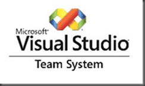

Updated and improved for Team System 2008.

{ .post-img }

[http://www.codeplex.com/TFSEventHandler](http://www.codeplex.com/TFSEventHandler "http://www.codeplex.com/TFSEventHandler")

The [TFS](http://msdn2.microsoft.com/en-us/teamsystem/aa718934.aspx "Team Foundation Server") Event Handler makes it easier to notify users of changes to Work Items in Team Foundation Server. You will no longer need to add individual alerts to users.

It is developed in .NET 3.5 SP1 for Team Foundation Server 2008 and is deployed as a system service.

The Alerts that you no longer need users to individually setup are:

- A work item is assigned to you.
- A work item that is assigned to you is reassigned to someone else.
- A work item that you created is assigned to someone else.

There is also a framework for [creating and deploying your own event handlers](http://www.codeplex.com/TFSEventHandler/Wiki/View.aspx?title=TFS%20Event%20Handlers%20v1.0&referringTitle=Home) that can do pretty much whatever you want. One of the shipped examples updates “Heat ITSM” whenever a work item that contains a Heat Id is changed.

Technorati Tags: [ALM](http://technorati.com/tags/ALM) [TFS Custom](http://technorati.com/tags/TFS+Custom) [WIT](http://technorati.com/tags/WIT) [TFS](http://technorati.com/tags/TFS)
