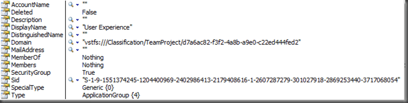

This is a lot harder than it sounds. At first you think there will be a built in option with the [Read Identities](http://msdn.microsoft.com/en-us/library/microsoft.teamfoundation.server.igroupsecurityservice.readidentities.aspx) method on the [IGroupSecurityService](http://msdn.microsoft.com/en-us/library/microsoft.teamfoundation.server.igroupsecurityservice.aspx) Interface, but you would be wrong!

When capturing an event from Team Foundation Server you have access to a lot of information about the change, including the Display Name of the fields for Assigned To and Changed By.

But what if you allow Work Items to be assigned to groups! First, lets achieve that. Create a group called “Program Management” on a project and add it into the “Contributors” list. We have a group for each of the advocacy groups in the CMMI process.

Edit your “Task” work item definition (you can use the power tools process editor or just edit the XML) and alter the Assigned To field to be the following:

```
   1: <FIELD reportable="dimension" type="String" name="Assigned To" rename="System.AssignedTo">
```

```
   2:   <ALLOWEXISTINGVALUE />
```

```
   3:   <ALLOWEDVALUES>
```

```
   4:     <LISTITEM value="[project]Contributors" />
```

```
   5:   </ALLOWEDVALUES>
```

```
   6: </FIELD>
```

Once you have updated your project you should be able to see all of the users as well as this new group displayed. If you were to assign a task to this group, how would you email everyone in that group so that they know they have been assigned something at all?

Well this needs a wee tweak of the [TFS Event Handler](http://codeplex.com/tfseventhandler)  to handle this, I will be releasing the full in place code with the TFS Event Handler v1.3 drop, but you can download my little test app I used to get it all working.

\[[Download Project](http://cid-57599e234f1ebc1c.skydrive.live.com/embedrowdetail.aspx/Public/CodeDrop/TFS%20Identity%20Retreval%20Test.rar "Download TFS Identity Retreval Test Source")\]

You can enter a display name of either a user or a group. And here is how it is done:

There is a little but of Active Directory lookup using a little method called GetUsername

```
   1: '' <summary>
```

```
   2: '' Retrieves a user's email address from Active Directory based on their display name
```

```
   3: '' </summary>
```

```
   4: Public Shared Function GetUsername(ByVal userDisplayName As String) As String
```

```
   5:     Dim ds As DirectoryServices.DirectorySearcher = New DirectoryServices.DirectorySearcher()
```

```
   6:     ds.PropertiesToLoad.Add("sAMAccountName")
```

```
   7:     ds.Filter = String.Format("(&(displayName={0})(objectCategory=person)((objectClass=user)))", userDisplayName)
```

```
   8: 
```

```
   9:     Dim results As DirectoryServices.SearchResultCollection = ds.FindAll()
```

```
  10:     If results.Count = 0 Then
```

```
  11:         Return String.Empty
```

```
  12:     End If
```

```
  13:     Dim values As DirectoryServices.ResultPropertyValueCollection = results(0).Properties("sAMAccountName")
```

```
  14:     If values.Count = 0 Then
```

```
  15:         Return String.Empty
```

```
  16:     End If
```

```
  17:     Return values(0).ToString()
```

```
  18: End Function
```

This retrieves the users sAMAccountName (or username) from Active Directory. Easy enough, and I already had it kicking about…

But in order to retrieve an identity that you are not sure is a group or a user, you will need to try to get the Group Identity first. This is because it is faster to wade through a maximum of 20 groups than potentially hundreds of users [mentioned on the MSDN Forum](http://social.msdn.microsoft.com/Forums/en-US/tfsworkitemtracking/thread/413bd663-707b-41af-83c7-c92015b0f80f/) answer below.

```
   1: Try
```

```
   2:            '----------------------------------------
```

```
   3:            Dim svr As New TeamFoundationServer(Me.uxTeamServer.Text)
```

```
   4:            Dim GroupSecurityService As IGroupSecurityService = CType(svr.GetService(GetType(IGroupSecurityService)), IGroupSecurityService)
```

```
   5:            '----------------------------------------
```

```
   6:            Dim CommonStructureService As ICommonStructureService = CType(svr.GetService(GetType(ICommonStructureService)), ICommonStructureService)
```

```
   7:            '----------------------------------------
```

```
   8:            ' Return App Group if you can
```

```
   9:            Dim pi As ProjectInfo = m_CommonStructureService.GetProjectFromName(Me.uxProject.Text)
```

```
  10:            Dim appGroup As Identity = (From i In m_GroupSecurityService.ListApplicationGroups(pi.Uri) Where i.DisplayName = Me.uxDisplayName.Text).SingleOrDefault
```

```
  11:            If Not appGroup Is Nothing Then
```

```
  12:                appGroup = m_GroupSecurityService.ReadIdentity(SearchFactor.Sid, appGroup.Sid, QueryMembership.Expanded)
```

```
  13:                WriteToLog(String.Format("Recieved identity for {0}", Me.uxDisplayName.Text))
```

```
  14:                WriteIdentity(appGroup)
```

```
  15:                Exit Try
```

```
  16:            End If
```

```
  17:            ' Not app group. Then return user is you can
```

```
  18:            Dim username As String = GetUsername(Me.uxDisplayName.Text)
```

```
  19:            Dim usrIdent As Identity = m_GroupSecurityService.ReadIdentity(SearchFactor.AccountName, username, QueryMembership.Expanded)
```

```
  20:            If Not usrIdent Is Nothing Then
```

```
  21:                WriteToLog(String.Format("Recieved identity for {0}", username))
```

```
  22:                WriteIdentity(usrIdent)
```

```
  23:                Exit Try
```

```
  24:            End If
```

```
  25:            '----------------------------------------
```

```
  26:            WriteToLog(String.Format("identity for {0} not found", Me.uxDisplayName.Text))
```

```
  27: 
```

```
  28:            '----------------------------------------
```

```
  29:        Catch ex As Exception
```

```
  30:            Me.uxResults.Items.Add(ex.ToString)
```

```
  31:        End Try
```

There is a lot going on here, but the first thing you need to do is retrieve the TFS objects that we will need to work with which include a [TeamFoundationServer](http://msdn.microsoft.com/en-us/library/microsoft.teamfoundation.client.teamfoundationserver.aspx) instance as well as an [IGroupSecurityService](http://msdn.microsoft.com/en-us/library/microsoft.teamfoundation.server.igroupsecurityservice.aspx) and [ICommonStructureService](http://msdn.microsoft.com/en-us/library/microsoft.teamfoundation.server.icommonstructureservice.aspx). You could use the [WorkItemStore](http://msdn.microsoft.com/en-us/library/microsoft.teamfoundation.workitemtracking.client.workitemstore.aspx) instead of the [ICommonStructureService](http://msdn.microsoft.com/en-us/library/microsoft.teamfoundation.server.icommonstructureservice.aspx), but the [WorkItemStore](http://msdn.microsoft.com/en-us/library/microsoft.teamfoundation.workitemtracking.client.workitemstore.aspx) has a heavy performance hit for retrieving an instance.

```
   1: Dim svr As New TeamFoundationServer(Me.uxTeamServer.Text)
```

```
   2: Dim GroupSecurityService As IGroupSecurityService = CType(svr.GetService(GetType(IGroupSecurityService)), IGroupSecurityService)
```

```
   3: Dim CommonStructureService As ICommonStructureService = CType(svr.GetService(GetType(ICommonStructureService)), ICommonStructureService)
```

Next we need to try and retrieve the Identity of the group, if it is one.  The ICommonStructureService  has a method for listing all of the Groups available within a project, but for that you need the project name which in the demo is just entered.

```
   1: ' Return App Group if you can
```

```
   2: Dim pi As ProjectInfo = m_CommonStructureService.GetProjectFromName(Me.uxProject.Text)
```

```
   3: Dim appGroup As Identity = (From i In m_GroupSecurityService.ListApplicationGroups(pi.Uri) Where i.DisplayName = Me.uxDisplayName.Text).SingleOrDefault
```

```
   4: If Not appGroup Is Nothing Then
```

```
   5:   appGroup = m_GroupSecurityService.ReadIdentity(SearchFactor.Sid, appGroup.Sid, QueryMembership.Expanded)
```

```
   6:   WriteToLog(String.Format("Recieved identity for {0}", Me.uxDisplayName.Text))
```

```
   7:   WriteIdentity(appGroup)
```

```
   8:   Exit Try
```

```
   9: End If
```

What this does is use the project name entered (in the event it is under the element ProtfolioProject (yea, I don’t know why it is called that either) to search a list of Group’s within your project for the one of interest.

Then, as it does not by default load the “Members” and “MemberOf” arrays you need to call ReadIdentity with the Expand option is you want to list the Members, and I do.

[](images/RetrievinganidentityfromTeamFoundationSe_E782-image_thumb-2-2.png)
{ .post-img }

If this does not return an identity, then we need to look at the display name being a user account.

```
   1: ' Not app group. Then return user is you can
```

```
   2: Dim username As String = GetUsername(Me.uxDisplayName.Text)
```

```
   3: Dim usrIdent As Identity = m_GroupSecurityService.ReadIdentity(SearchFactor.AccountName, username, QueryMembership.Expanded)
```

```
   4: If Not usrIdent Is Nothing Then
```

```
   5:   WriteToLog(String.Format("Recieved identity for {0}", username))
```

```
   6:   WriteIdentity(usrIdent)
```

```
   7:   Exit Try
```

```
   8: End If
```

Actually quite easy, but it could be easier.

Example WorkItemChangedEvent:

```
   1: <?xml version="1.0" encoding="utf-8"?>
```

```
   2: <WorkItemChangedEvent xmlns:xsi="http://www.w3.org/2001/XMLSchema-instance" xmlns:xsd="http://www.w3.org/2001/XMLSchema">
```

```
   3:   <PortfolioProject>TFS Sticky Buddy</PortfolioProject>
```

```
   4:   <ProjectNodeId>614c944e-7799-46a2-a519-30e68eea040b</ProjectNodeId>
```

```
   5:   <AreaPath>TFS Sticky Buddy</AreaPath>
```

```
   6:   <Title>TFS Sticky Buddy Work Item Changed: Requirement 1267 - Visual Enhancement</Title>
```

```
   7:   <WorkItemTitle>Mobility Continental Exceptions Report</WorkItemTitle>
```

```
   8:   <Subscriber>HINSHDOMsvc_tfsservices</Subscriber>
```

```
   9:   <ChangerSid>S-1-5-21-1390067357-651377827-682003330-21716</ChangerSid>
```

```
  10:   <DisplayUrl>http://tfs01.hinshelwood.com:8080/workitemtracking/workitem.aspx?artifactmoniker=1267</DisplayUrl>
```

```
  11:   <TimeZone>GMT Standard Time</TimeZone>
```

```
  12:   <TimeZoneOffset>00:00:00</TimeZoneOffset>
```

```
  13:   <ChangeType>Change</ChangeType>
```

```
  14:   <CoreFields>
```

```
  15:     <IntegerFields>
```

```
  16:       <Field>
```

```
  17:         <Name>ID</Name>
```

```
  18:         <ReferenceName>System.Id</ReferenceName>
```

```
  19:         <OldValue>1267</OldValue>
```

```
  20:         <NewValue>1267</NewValue>
```

```
  21:       </Field>
```

```
  22:       <Field>
```

```
  23:         <Name>Rev</Name>
```

```
  24:         <ReferenceName>System.Rev</ReferenceName>
```

```
  25:         <OldValue>4</OldValue>
```

```
  26:         <NewValue>5</NewValue>
```

```
  27:       </Field>
```

```
  28:       <Field>
```

```
  29:         <Name>AreaID</Name>
```

```
  30:         <ReferenceName>System.AreaId</ReferenceName>
```

```
  31:         <OldValue>551</OldValue>
```

```
  32:         <NewValue>551</NewValue>
```

```
  33:       </Field>
```

```
  34:     </IntegerFields>
```

```
  35:     <StringFields>
```

```
  36:       <Field>
```

```
  37:         <Name>Work Item Type</Name>
```

```
  38:         <ReferenceName>System.WorkItemType</ReferenceName>
```

```
  39:         <OldValue>Requirement</OldValue>
```

```
  40:         <NewValue>Requirement</NewValue>
```

```
  41:       </Field>
```

```
  42:       <Field>
```

```
  43:         <Name>Title</Name>
```

```
  44:         <ReferenceName>System.Title</ReferenceName>
```

```
  45:         <OldValue>Visual Enhancement</OldValue>
```

```
  46:         <NewValue>Visual Enhancement</NewValue>
```

```
  47:       </Field>
```

```
  48:       <Field>
```

```
  49:         <Name>Area Path</Name>
```

```
  50:         <ReferenceName>System.AreaPath</ReferenceName>
```

```
  51:         <OldValue>TFS Sticky Buddy</OldValue>
```

```
  52:         <NewValue>TFS Sticky Buddy</NewValue>
```

```
  53:       </Field>
```

```
  54:       <Field>
```

```
  55:         <Name>State</Name>
```

```
  56:         <ReferenceName>System.State</ReferenceName>
```

```
  57:         <OldValue>Active</OldValue>
```

```
  58:         <NewValue>Active</NewValue>
```

```
  59:       </Field>
```

```
  60:       <Field>
```

```
  61:         <Name>Reason</Name>
```

```
  62:         <ReferenceName>System.Reason</ReferenceName>
```

```
  63:         <OldValue>Accepted</OldValue>
```

```
  64:         <NewValue>Accepted</NewValue>
```

```
  65:       </Field>
```

```
  66:       <Field>
```

```
  67:         <Name>Assigned To</Name>
```

```
  68:         <ReferenceName>System.AssignedTo</ReferenceName>
```

```
  69:         <OldValue>Mike Hunt</OldValue>
```

```
  70:         <NewValue>Mike Hunt</NewValue>
```

```
  71:       </Field>
```

```
  72:       <Field>
```

```
  73:         <Name>Changed By</Name>
```

```
  74:         <ReferenceName>System.ChangedBy</ReferenceName>
```

```
  75:         <OldValue>Martin Hinshelwood</OldValue>
```

```
  76:         <NewValue>Mike Hunt</NewValue>
```

```
  77:       </Field>
```

```
  78:       <Field>
```

```
  79:         <Name>Created By</Name>
```

```
  80:         <ReferenceName>System.CreatedBy</ReferenceName>
```

```
  81:         <OldValue>Mike Hunt</OldValue>
```

```
  82:         <NewValue>Mike Hunt</NewValue>
```

```
  83:       </Field>
```

```
  84:       <Field>
```

```
  85:         <Name>Changed Date</Name>
```

```
  86:         <ReferenceName>System.ChangedDate</ReferenceName>
```

```
  87:         <OldValue>01/12/2008 16:05:21</OldValue>
```

```
  88:         <NewValue>02/12/2008 12:17:08</NewValue>
```

```
  89:       </Field>
```

```
  90:       <Field>
```

```
  91:         <Name>Created Date</Name>
```

```
  92:         <ReferenceName>System.CreatedDate</ReferenceName>
```

```
  93:         <OldValue>01/12/2008 13:51:22</OldValue>
```

```
  94:         <NewValue>01/12/2008 13:51:22</NewValue>
```

```
  95:       </Field>
```

```
  96:       <Field>
```

```
  97:         <Name>Authorized As</Name>
```

```
  98:         <ReferenceName>System.AuthorizedAs</ReferenceName>
```

```
  99:         <OldValue>Martin Hinshelwood</OldValue>
```

```
 100:         <NewValue>Mike Hunt</NewValue>
```

```
 101:       </Field>
```

```
 102:       <Field>
```

```
 103:         <Name>Iteration Path</Name>
```

```
 104:         <ReferenceName>System.IterationPath</ReferenceName>
```

```
 105:         <OldValue>TFS Sticky BuddyR4</OldValue>
```

```
 106:         <NewValue>TFS Sticky BuddyR4</NewValue>
```

```
 107:       </Field>
```

```
 108:     </StringFields>
```

```
 109:   </CoreFields>
```

```
 110:   <ChangedFields>
```

```
 111:     <IntegerFields />
```

```
 112:     <StringFields>
```

```
 113:       <Field>
```

```
 114:         <Name>Changed By</Name>
```

```
 115:         <ReferenceName>System.ChangedBy</ReferenceName>
```

```
 116:         <OldValue>Martin Hinshelwood</OldValue>
```

```
 117:         <NewValue>Mike Hunt</NewValue>
```

```
 118:       </Field>
```

```
 119:     </StringFields>
```

```
 120:   </ChangedFields>
```

```
 121: </WorkItemChangedEvent>
```

And what did I have to use to figure this out?

- [Blog: Retrieving user email & display name from Team Foundation Server](http://peterblomqvist.blogspot.com/2007/08/retrieving-user-email-display-name-from.html)

- [MSDN:  Team Foundation Server SDK: Identity.DisplayName Property](http://msdn.microsoft.com/en-us/library/microsoft.teamfoundation.server.identity.displayname.aspx "http://msdn.microsoft.com/en-us/library/microsoft.teamfoundation.server.identity.displayname(VS.80).aspx")

- [Blog: Making sure your team project's groups only contain groups](http://blogs.msdn.com/jmanning/archive/2007/02/26/making-sure-your-team-project-s-groups-only-contain-groups.aspx)

- [MSDN Forum: How to get user Identity having its display name?](http://social.msdn.microsoft.com/Forums/en-US/tfsworkitemtracking/thread/413bd663-707b-41af-83c7-c92015b0f80f/) (How NOT to do it)

- [MSDN: Reference for Team Foundation Server SDK: IGroupSecurityService.ReadIdentities Method](http://msdn.microsoft.com/en-us/library/microsoft.teamfoundation.server.igroupsecurityservice.readidentities.aspx)

- [MSDN Forum: How can I use ReadIdentity function in VSTS](http://social.msdn.microsoft.com/Forums/en-US/tfssetup/thread/5881306a-4e86-4428-8be0-3ba56e9be0ea/)

- [Blog: how to list the users/groups the server knows about?](http://blogs.msdn.com/jmanning/archive/2006/05/02/588648.aspx)

As you can see there was a lot of research, which does not include all the stuff I already know from doing the [TFS Sticky Buddy](http://codeplex.com/tfsstickybuddy) and the [TFS Event Handler](http://codeplex.com/tfseventhandler).

I think that this was an unnecessary complexity and there should be an additional option for the [Search Factor](http://msdn.microsoft.com/en-us/library/microsoft.teamfoundation.server.searchfactor.aspx) enumeration should be added to make this easier.

Technorati Tags: [ALM](http://technorati.com/tags/ALM) [CodeProject](http://technorati.com/tags/CodeProject) [TFS](http://technorati.com/tags/TFS)
