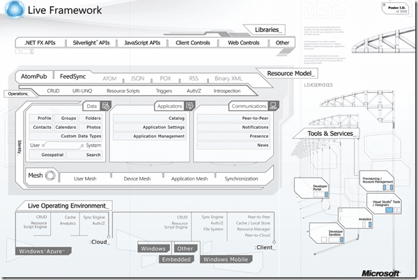

I have been getting very interested in the new [Azure Services Platform](http://www.microsoft.com/azure/register.mspx) and how I can use it to facilitate WPF development.

{ .post-img }

Imagine being able to launch a ClickOnce application from anywhere and for it to have exactly the same configuration and settings in all locations, or imagine being able to chat with other users of the application while you are using it.

This things have been relegated to large companies who can afford to support the infrastructure that you would need to run this. In fact, the only industry that I can think of that currently does this with applications is the Gaming industry. If you look at the capabilities of Xbox Live and think of all the cool things your users could achieve if the same communication and collaboration tools were available within even the simplest application.

For example, if I was to think of a couple of simple things that I would like the [TFS Sticky Buddy](http://codeplex.com/tfsstickybuddy) to be able to do:

- Central storage for configuration (single setup across multiple computers)
- Chat with members of your team to be identified by linking your Team System login and email with you Live ID.
- Presence information on those team members, or anyone you might need to interact with.

Coool…..

Technorati Tags: [Azure](http://technorati.com/tags/Azure) [Live](http://technorati.com/tags/Live) [WPF](http://technorati.com/tags/WPF) [WIT](http://technorati.com/tags/WIT) [ALM](http://technorati.com/tags/ALM) [TFS](http://technorati.com/tags/TFS)

