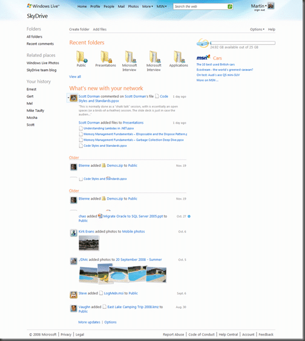

{ .post-img }

Some of the new Windows Live Wave 3 services have gone live over the last couple of days. One of the best IMO is the [SkyDrive services](http://skydrive.live.com), updated to 25GB and with complete integration with other services like [Photo Share](http://photos.live.com), [Connect to people](http://profile.live.com/connect)…

{ .post-img }

You can connect to your Facebook and LinkedIn contacts as well :)

{ .post-img }

A nice feature is the ability to link your live accounts so you can easily switch from your clever \[yourname\]@\[yourdomain\].com to your nasty \[yourname\]@live.com address.

{ .post-img }

As you can see from the menu structure, all of your services are all in one place, although some of those other services, OneCare for example, have not yet been updated as you can’t get back into the same bits… I am sure it will come…

The SkyDrive service has had a major overall and has a nice new home page as well as the integration with Live Photo and a whopping 25gb of space…

{ .post-img }

Here is a comprehensive list of all [Windows Live services](http://home.live.com/allservices.aspx) currently available with the exception of the fantastic [Live Mesh](http://mesh.live.com) which is still in beta.

#### Windows Live

- [Home](http://g.live.com/9uxp9en-gb/hdr_main1??su=http://shared.live.com/)  
   Get a quick view of your world—e-mail, invitations, and what’s new with your network.
- [Profile](http://g.live.com/9uxp9en-gb/hdr_main2??su=http://shared.live.com/)  
   Share your world online–your activities, your photos, and the people you know.
- [People](http://g.live.com/9uxp9en-gb/hdr_main3??su=http://shared.live.com/)  
   Manage your contacts from Hotmail, Messenger, and Profile, all in one place.
- [Mail](http://g.live.com/9uxp9en-gb/hdr_main4??su=http://shared.live.com/)  
   Get fast, easy, reliable e-mail from Hotmail, with more spam protection and plenty of storage.
- [Photos](http://g.live.com/9uxp9en-gb/hdr_main5??su=http://shared.live.com/)  
   Post your favourite shots online in beautiful slideshows that only the people you choose can see.
- [Calendar](http://g.live.com/9uxp9en-gb/hdr_main6??su=http://shared.live.com/)  
   Check your schedule, share calendars with others, and get reminders when you need them.
- [Events](http://g.live.com/9uxp9en-gb/hdr_more12??su=http://shared.live.com/)  
   Plan your next event with customized invitations, a guest list, RSVPs, and a place to share online.
- [SkyDrive](http://g.live.com/9uxp9en-gb/hdr_more2??su=http://shared.live.com/)  
   Store the files you need online and share them with the people you choose.
- [Groups](http://g.live.com/9uxp9en-gb/hdr_more1??su=http://shared.live.com/)  
   Bring your team, club, or other group together with a webpage, calendar, and more.
- [Spaces](http://g.live.com/9uxp9en-gb/hdr_more11??su=http://shared.live.com/)  
   Express yourself with your own customized webpage—add a blog, photos, videos, and more.
- [Family Safety](http://g.live.com/9uxp9en-gb/hdr_more4??su=http://shared.live.com/)  
   Help protect your kids online, with customizable web filters and contact management.
- [Mobile](http://g.live.com/9uxp9en-gb/hdr_more6??su=http://shared.live.com/)  
   Stay in sync from the road, with Windows Live on your web-enabled mobile device.
- [Downloads](http://g.live.com/9uxp9en-gb/hdr_more5??su=http://shared.live.com/)  
   Download Windows Live Essentials—free programs for your PC, including Messenger, Mail, Photo Gallery, Movie Maker, Writer, Toolbar, and Family Safety.
- [Office Live](http://g.live.com/9uxp9en-gb/hdr_more9??su=http://shared.live.com/)  
   Store and share your business documents online—it’s quick, easy, and free.

Technorati Tags: [Live](http://technorati.com/tags/Live) [Answers](http://technorati.com/tags/Answers)

