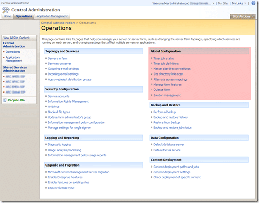
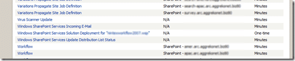
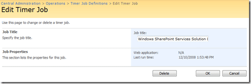

If, like me, you tried to deploy a solution to Microsoft Office SharePoint Server 2007 and it ether failed or hung you will need to remove it somehow. But once the status has moved to “deploying”, if you receive an error like this:

> Error: The web.config is invalid on this IIS Web Site: C:InetpubwwwrootwssVirtualDirectoriessearch.xxx.xxx.biz80web.config.

You will need to manually remove the job.

To do this, go to the Central Administration portal and under the “Global Configuration” section on the “Operations” tab select “Job Timer definitions”

{ .post-img }

This will take you to a massive list of all the scheduled and on demand jobs. Check down the list to find the job you want to kill, the Deployment operations will have “one-time” in the last column.

{ .post-img }

Click the title to bring up the job definition and status and you should have the kill switch readily available

{ .post-img }

Once killed you can check the deployments page and you will see that there is nothing trying to “deploy”.

Technorati Tags: [MOSS](http://technorati.com/tags/MOSS) [SharePoint](http://technorati.com/tags/SharePoint)
