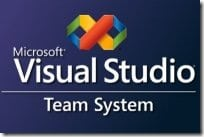

{ .post-img }

After making sending a “Call to Action” to my fellow Team System MVP’s I have added two managers to the [VSTS Developers](//www.linkedin.com/e/gis/104499) group I started on LinkedIn.

- [Ed Blankenship](https://mvp.support.microsoft.com/profile/ed.blankenship "Ed Blankenship's MVP Profile") - \[[LinkedIn](http://www.linkedin.com/in/edblankenship "Ed Blankenship's LinkedIn profile")\] \[[Blog](http://www.edsquared.com/ "Ed Blankenship's Blog")\] \[[Company blog](http://blogs.infragistics.com/blogs/eblankenship/ "Ed Blankenship's Infragistics Blog")\]
- [Michael Ruminer](https://mvp.support.microsoft.com/profile=F0D2A3A2-D5D9-485A-95C2-25678D11FA0C "Michael Ruminer's MVP Profile") - \[[LinkedIn](http://www.linkedin.com/pub/3/42/794 "Michael Ruminer's LinkedIn profile")\] \[[Blog](http://manicprogrammer.com/cs/blogs/michaelruminer/ "Michael Ruminer's Blog")\]

Thanks guys for giving up a little bit of your valuable time….

Hopefully, this will give members more information and a faster response time to requests…

Technorati Tags: [ALM](http://technorati.com/tags/ALM) [TFS](http://technorati.com/tags/TFS)
