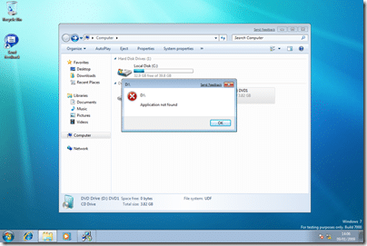
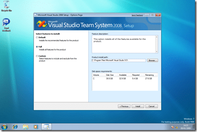
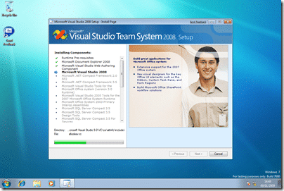

I am installing VS2008 in a virtual environment, so this may not be exactly what you would get, but the purpose is to identify if VS2008 does indeed work on Windows 7 and what the experience is like.

The first problem is that the auto run does not seam to function.

{ .post-img }

This can be rectified by browsing the CD / Image and running setup.exe

{ .post-img }

So far so good.

{ .post-img }

After you have accepted the licence agreement you need to select the installation components.

{ .post-img }

I am selecting Full so we can make sure it all goes on, but usually I remove SQL Express as I would add SQL Server developer edition later.

{ .post-img }

It’s that guy again :), we need to let this cook for “some time, or considerably longer”…

{ .post-img }

Some time later….

{ .post-img }

After some 2 hours (remember I am in a virtual computer)

I now have Visual Studio 2008 Team Suit installed…

{ .post-img }

I will need to service pack it and check functionality, probably by working on the [TFS Sticky Buddy](http://codeplex.com/tfsstickybuddy) project on it and making sure that I an still deploy and run on other platforms! That is for another day though…

Technorati Tags: [Windows](http://technorati.com/tags/Windows) [ALM](http://technorati.com/tags/ALM) [VS 2008](http://technorati.com/tags/VS+2008) [TFS](http://technorati.com/tags/TFS)

