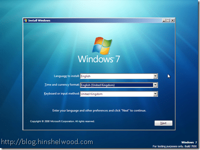
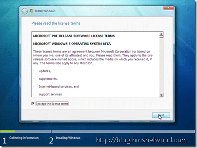
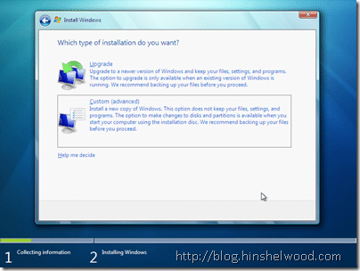
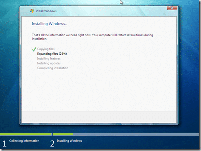
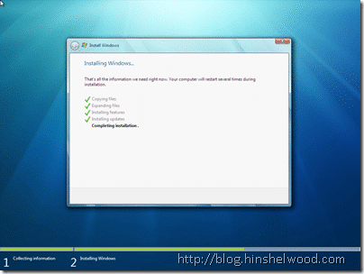
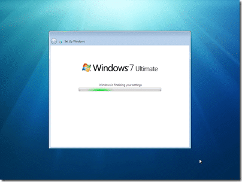
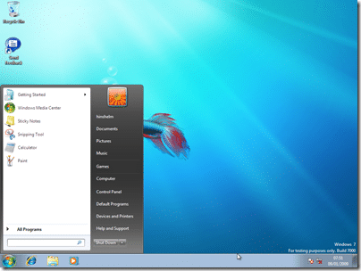

Installing Windows 7 is so similar to the Vista install it almost does not deserve a post on it, but as I did not do a Vista install post, and I am waiting for the install to complete, I though you should see, erm…. the nice new colours…

I am installing on a virtual environment (Virtual PC) on my desktop so any timings for the install are largely irrelevant, but my Host computer had Dual Quad core Xeon’s and some serious HDD and RAM speeds.

{ .post-img }

I only get a 3.3 because my graphics card is not a very expensive one…

### Install

{ .post-img }

I gave the VM 1.5 GB of RAM…

{ .post-img }

{ .post-img }

{ .post-img }

For some reason the “Upgrade” option was available! Bug maybe…

{ .post-img }

{ .post-img }

{ .post-img }

I was quite surprised to see that I got this far in around 10 minutes… I barely have time too keep up with my post!

{ .post-img }

And less than 10 minutes after that!

{ .post-img }

Well the install is done, now we are at fist boot..

### First Boot

{ .post-img }

After this you will be asked for your product key, and then the standard setup questions…

{ .post-img }

{ .post-img }

{ .post-img }

{ .post-img }

### My First Windows 7 Desktop

{ .post-img }

 
{ .post-img }

All in all, a very nice experience so far… I will probably be running at home as well, but I do not expect that install to take 25 minutes!

My computer at home is a P4 3.1Ghz with 1GB of ram… :(

Technorati Tags: [Windows](http://technorati.com/tags/Windows)
