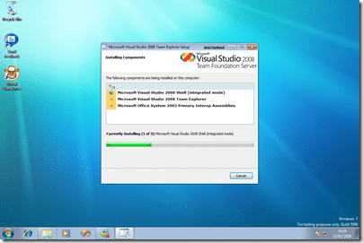
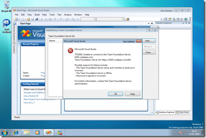
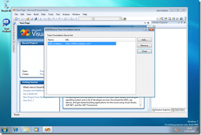
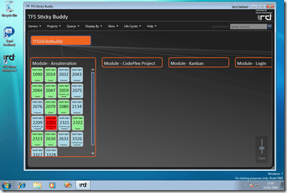
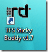

I was a little lazy last time and did not install either Team Explorer, or SP1 on my visual studio instance. So, lets get to it…

{ .post-img }

Everything fine with the Team Explorer install so far, but I have seen other people with this working as well. The fun seams to start when you get SP1 out of the bag, so we will start by Connecting to [CodePlex](http://www.codeplex.com "CodePlex"), and using [TFS Sticky Buddy](http://codeplex.com/tfsstickybuddy)…

{ .post-img }

Yea baby!

{ .post-img }

Well it looks like I have been hampered by my proxy server at work… no way round that one… I can get web pages, but application can’t connect…

{ .post-img }

And, not a proxy issue after all, but a firewall issue! Still can’t get the “Send Feedback” to sign in… now that is probably a proxy/websence issue…

{ .post-img }

This is a new one on me, and I needed to threaten Visual Studio with the “End Task” button to get it to respond… Maybe I need SP1 on Windows 7?

Tune in next time for some SP1 antics…

P.S. [TFS Sticky Buddy](http://codeplex.com/tfsstickybuddy) works, but I think I am going to need a blue theme…

{ .post-img }

Ewww, and check out that nasty logo…

{ .post-img }

Technorati Tags: [ALM](http://technorati.com/tags/ALM) [Personal](http://technorati.com/tags/Personal) [Windows](http://technorati.com/tags/Windows) [TFS](http://technorati.com/tags/TFS)
