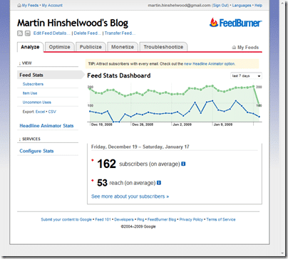

As some of you may know, Feedburner ([http://feedburner.com](http://feedburner.com)) was acquired some time ago by Google… But they are now actively migrating their content to Google servers ([http://feedburner.google.com](http://feedburner.google.com "http://feedburner.google.com")) and I have taken the plunge… if you are having any problems with my feeds then please let me know so I can rectify it…

If you have not yet taken the plunge it is a fairly simple process and should not impact your existing posts and URL’s…

That said I can imagine that it is quite a complicated process behind the scenes and although a redirect is setup from your [http://feeds.feedburner.com/MartinHinshelwood](http://feeds.feedburner.com/MartinHinshelwood)  URL’s to your new  [http://feeds2.feedburner.com/MartinHinshelwood](http://feeds2.feedburner.com/MartinHinshelwood "http://feeds2.feedburner.com") this will incur and additional overhead that will affect the load speed. To remove that overhead, you need to change all of your feed URL’s…

{ .post-img }

Although you do get less options, Google has promised that more functionality will be added and that the stats will be more accurate…

We will see…

Technorati Tags: [Personal](http://technorati.com/tags/Personal)
