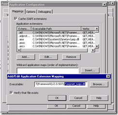

Have you ever, when developing a website, been frustrated when you get a different result when you deploy your application to [http://site/](http://site/) and [http://site/app/](http://site/app/).

[](http://blog.hinshelwood.com/files/2011/05/GWB-WindowsLiveWriter-ReformatyourCSSonthefly_E44D-iStock_000001095647XSmall_2.jpg)
{ .post-img }

I don’t know about you, but it annoys the hell out of me. All that work in CSS and none of your images work when you run it in a different location. This would be especially frustrating when you are running multiple feature branches and need Kerberos interaction. The amount of work required to get Kerberos to work (SPN’s, URL’s, Delegation and AD) limits the number of sites you can have in an enterprise environment.

I have just two. I have a site for the latest candidate release and one to host all of my feature branches. As I am using TFS I identify my Feature with either a Requirement or Change Request Id and name everything after this.

Thus I have [http://site/](http://site/) and [http://site-dev/1345](http://site-dev/1345). This makes it easy to find and test, and my CI build at the ends of the day just overwrites the previous version.

This means that all of your css like this…

```
.down {
   padding-right:14px;
   background: url('/UI/Resources/Images/arrow_down.gif') no-repeat 100% 50%;
}
```

…will not work in one of your locations :( This makes me sad…

So, in order to cheer up your CSS, you can give it a little bit of .NET Omph…

The first thing you need to do is get .NET to handle ALL of your requests, and not just for the ASP.NET pages.

[](http://blog.hinshelwood.com/files/2011/05/GWB-WindowsLiveWriter-ReformatyourCSSonthefly_E44D-image_2.png)
{ .post-img }

Add a “Wildcard application mapping” to the “aspnet_isapi.dll” and you are good to go…

To process the css we need an HttpHandler, this is dead easy to implement and action so:

```
Imports System.Web
Imports System.Text.RegularExpressions


Public Class CssHttpHandler
    Implements IHttpHandler

    Public ReadOnly Property IsReusable() As Boolean Implements System.Web.IHttpHandler.IsReusable
        Get
            Return False
        End Get
    End Property

    Public Sub ProcessRequest(ByVal context As System.Web.HttpContext) Implements System.Web.IHttpHandler.ProcessRequest
        context.Response.ContentType = "text/css"

        'Get the file from the query stirng
        Dim File As String = context.Request.FilePath

        ' Find the actual path
        Dim Path As String = context.Server.MapPath(File)

        'Limit to only css files
        If Not System.IO.Path.GetExtension(Path) = ".css" Then
            context.Response.End()
        End If

        'Make sure file exists
        If Not System.IO.File.Exists(Path) Then
            context.Response.End()
        End If


        ' Open the file, read the contents and replace the variables
        Using css As System.IO.StreamReader = New System.IO.StreamReader(Path)
            Dim cssText As String = css.ReadToEnd()

            ' Replace url's
            Dim rximg As New Regex("url('*(.+?)'*)")
            For Each m As Match In rximg.Matches(cssText)
                cssText = cssText.Replace(m.Groups(1).Value, HandleRootOperator(m.Groups(1).Value))
            Next

            context.Response.Write("/* Please use the ~ operator in front of all URL's. e.g. url('~/UI/Resources/Images/Image.gif') will be converted at runtime to point at the root of the application. */" & vbCrLf & cssText)
        End Using

    End Sub

    ' Methods
    Public Function HandleRootOperator(ByVal virtualUrl As String) As String
        If Not String.IsNullOrEmpty(virtualUrl) Then
            If virtualUrl.StartsWith("^~/", StringComparison.OrdinalIgnoreCase) Then
                Return ("^" & Me.applicationPath & virtualUrl.Substring(2))
            End If
            If virtualUrl.StartsWith("~/", StringComparison.OrdinalIgnoreCase) Then
                Return (Me.applicationPath & virtualUrl.Substring(1))
            End If
        End If
        Return virtualUrl
    End Function


    ' Fields
    Private applicationPath As String = IIf((HttpRuntime.AppDomainAppVirtualPath.Length > 1), HttpRuntime.AppDomainAppVirtualPath, String.Empty)


End Class
```

Now add the Handler to you web.config

```
<httpHandlers>
  <add verb="*" path="*.css" type="Company.System.Product.CssHttpHandler, Company.System.Product" />
</httpHandlers>
```

And you are done :)

Technorati Tags: [.NET](http://technorati.com/tags/.NET) [Windows](http://technorati.com/tags/Windows) [CodeProject](http://technorati.com/tags/CodeProject)
