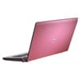
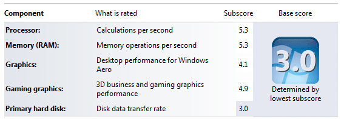

We have needed a new laptop in the Hinshelwood household for a while now. My old laptop was 8 years old, and although it was a mobile desktop, it ran Vista like a dog… Now the main use of a laptop in our household is for internet and pictures, but I defiantly wanted to run Windows 7.

My wife's only caveat was that it had to be pink!

{ .post-img }

I know, but it upped the WAF from about a 3 to a 10.

If you are looking for a cheap quality laptop in the UK then you should look no further than Tesco Direct. Scary eigh… but true…

We picked up this [Dell Studio 15 PDC T3400 4GB 250GB 15.4"](http://direct.tesco.com/q/R.205-2678.aspx) for £550.

Its a pretty good laptop. even if it is pink :)

{ .post-img }

And it runs Windows 7 like a dream. Most of the features are actually faster than Vista, but I did install Windows 7 64x and not the 32x OS that it came with.

With this setup I will not only get my wife's opinion of Windows 7 as a complete non technical, but I will be able to do some of the beta

tasks that are set us on the [connect site](http://connect.microsoft.com/) without having to boot a virtual computer in work…

P.S. If I can get the WAF value up I will get myself a [Dell Studio XPS16 T6400 4GB 320GB Blu-Ray 16" Laptop](http://direct.tesco.com/q/R.205-4343.aspx), but I will not be holding my breath…

Technorati Tags: [Personal](http://technorati.com/tags/Personal) [Windows](http://technorati.com/tags/Windows)
