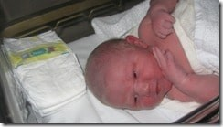
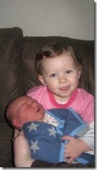
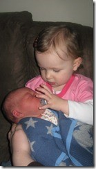

We have just had another addition to the family… Kaiden Ryan William Hinshelwood was born at 12:01 on 5th February 2009.

{ .post-img }

If you remember 19 months ago when my daughter was born my wife has a [very quick delivery](http://blog.hinshelwood.com/archive/2007/06/25/The-Delivery.aspx), 45 minutes to be precise. Well it was quicker this time. She went into labour at 11:55am and my son was born at 12:01pm :) Luckily we were already at the hospital for an induction as my wife had been in distress for some weeks…

{ .post-img }

Kaiden is getting on well with his sister, but she does keep trying to shove his “Nonie” (my daughters name for a Dummy/pacifier) in his face wither he wants it or not.

{ .post-img }

Technorati Tags: [Personal](http://technorati.com/tags/Personal)
