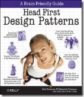

{ .post-img }

Over the last month I have been reading [Head First Design Patterns](http://www.amazon.co.uk/gp/product/0596007124?ie=UTF8&tag=dyslexicdev-21&linkCode=as2&camp=1634&creative=6738&creativeASIN=0596007124). This an excellent book and I only wish that all tech books used some of the principals of learning that are contained in it. As [Jeff Attwood](http://www.codinghorror.com) has [noted](http://www.codinghorror.com/blog/archives/000380.html) there are some problems with the content of this book, but the thing that I love is it’s, and all the other books in the [Head First](http://www.headfirstlabs.com/) series ability to interact with your brain in a more effective manor.
{ .post-img }

If you are dyslexic or indeed have any sort of learning difficulty caused by the way information is imparted in our society then you will love this book. Even if you don't then the same disability principals apply… If is easier for people with particular problems to use then that makes it easier for everyone.

The idea is that the way your brain LIKES to assimilate information is not conducive to a lot of reading. Have you ever read a whole chapter of a tech book, and then thought to yourself, “What was that chapter about?”. This is because, unless your brain is stimulated it will usually disregard the information as irrelevant.

The [Head First](http://www.headfirstlabs.com/) series uses pictures and concepts to encourages your brain to produce chemicals in order to trick it into remembering more of the information.

I would recommend this book to any budding and exiting author of technical books…

Technorati Tags: [Dyslexia](http://technorati.com/tags/Dyslexia)
