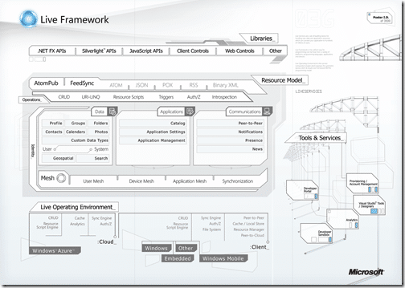

Microsoft has just released a new [Training Kit](http://go.microsoft.com/fwlink/?LinkID=130354)  for [Windows Azure](http://www.microsoft.com/azure/windowsazure.mspx) that updates the one released at the PDC. Not since [Windows Communication Foundation](http://wcf.netfx3.com "Windows Communication Foundation") and WPF have I been so exited about a new technology, but [Windows Azure](http://www.microsoft.com/azure/windowsazure.mspx) is it.

{ .post-img }

If you are not really sure what Azure is, it is a set of services that can be wired together with custom Cloud services to create dynamically scaling services and applications. It’s a little more complicated than that ;) but you get the jist.

{ .post-img }

The Live services piece is the cream of the crop for providing services to your applications. I am still trying to get access to the CTP so I can super charge my [TFS Sticky Buddy](http://codeplex.com/tfsstickybuddy) application….

The Azure Services Training Kit February update now includes the following content covering Windows Azure, .NET Services, SQL Services, and Live Services:

- 13 hands-on labs – including 3 new hands-on labs for the Live Framework & Services
- 19 new demo scripts – These demo scripts are designed to provide detailed walkthroughs of key features so that someone can easily give a demo of a service
- 10 new scripted presentations – the presentations used for our 3 day training workshops including detailed speaker notes.

[http://go.microsoft.com/fwlink/?LinkID=130354](http://go.microsoft.com/fwlink/?LinkID=130354 "http://go.microsoft.com/fwlink/?LinkID=130354")

Technorati Tags: [.NET](http://technorati.com/tags/.NET) [Azure](http://technorati.com/tags/Azure) [WPF](http://technorati.com/tags/WPF) [TFS](http://technorati.com/tags/TFS)
