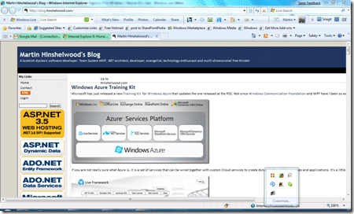

Although if you are a Windows 7 user like me, you will not be able to download the newly released [Internet Explorer 8](http://www.microsoft.com/ie8), if you have XP or Vista you can dive into the experience that many people have been using for a while now.

{ .post-img }

Join the party and [download Internet Explorer 8](http://www.microsoft.com/ie8) today…

This is, as you would expect, the best browser from Microsoft to date. And yes, may other browsers are faster… but no other offers the level of compatibility and extensibility offered by IE. I have used Firefox and Google Chrome, and often have Firefox installed for those times when IE will not cooperate, but I always get frustrated and go back to Internet Explorer….

UPDATE (2009-03-23): Apparently an independent study study by Microsoft has shown that IE8 is faster than Firefox and Chrome! I will be using IE8 even if that is not true :)

Technorati Tags: [Windows](http://technorati.com/tags/Windows)
