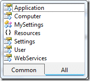
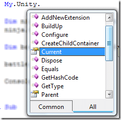

I have been attempting to integrate the Unity Application Block into my website to allow me to share the same base object code between a WPF and an ASP.NET application. I will let you know how I am getting along later as I am still knee deep in refactoring, but I have found something a little useful.

I have created a custom “My” object in Visual Studio. This means that I can do “My.Unity.Container” to retrieve my UnityContainer object form anywhere is my code. I know it my be trivial to achieve in other ways, but I am a VB degenerate having fun, so leave me alone…

The first thing we need is a way of consistently creating a singleton instance of our UnityContainer across all of our code in the AppDomain.

```
Imports Microsoft.Practices.Unity

Public Class UnityContainer
    Inherits Microsoft.Practices.Unity.UnityContainer

    Private Shared sm_UnityContainer As Microsoft.Practices.Unity.UnityContainer
    Private Shared sm_syncRoot As New Object

    Private Sub New()
        MyBase.New()
    End Sub

    Public Shared ReadOnly Property Current() As Microsoft.Practices.Unity.UnityContainer
        Get
            If (sm_UnityContainer Is Nothing) Then
                SyncLock sm_syncRoot
                    If (sm_UnityContainer Is Nothing) Then
                        sm_UnityContainer = New UnityContainer
                        'Dim section As UnityConfigurationSection = ConfigurationManager.GetSection("unity")
                        'section.Containers.Default.Configure(sm_UnityContainer)
                    End If
                End SyncLock
            End If
            Return sm_UnityContainer
        End Get
    End Property

End Class
```

I have commented the lines out, but you could also initialise the Unity Container from a config file, but remember that it will be the top level config of your application root an not the config from the Assembly that you code happens to be in.

We could just leave it at that, and If you use C# this is about your lot, but in VB you have the “My” namespace that gives you access to some useful things all in one place.

[](http://blog.hinshelwood.com/files/2011/05/GWB-WindowsLiveWriter-NinjaUnity_B1DE-image_6.png)
{ .post-img }

In order to achieve this you need to create a Module in the “My” namespace that has a single property that access the previous class.

```
Imports Common

Namespace My

  <HideModuleName()> _
  Module MyUnityExtensions

        Friend ReadOnly Property Unity() As UnityContainer
            Get
                Return UnityContainer.Current
            End Get
        End Property

    End Module

End Namespace
```

This the allows you to access the UnityContainer object in the same way that you would access My.User.

[](http://blog.hinshelwood.com/files/2011/05/GWB-WindowsLiveWriter-NinjaUnity_B1DE-image_8.png)
{ .post-img }

Inside the Unity object you will have all of the shared properties and methods that we created earlier.

[](http://blog.hinshelwood.com/files/2011/05/GWB-WindowsLiveWriter-NinjaUnity_B1DE-image_12.png)
{ .post-img }

To examine the use of this I have followed [O1eg Smirnov](http://www.codeproject.com/Members/O1eg-Smirnov)’s [Ninja Dependency Injection](http://www.codeproject.com/KB/architecture/UnityApplicationBlockNDI.aspx) scenario.

So, I have a Console application that registers a sword type and the resolves out a Ninja Object using Unity.

```
Imports NinjaCommon

Module Module1

    Sub Main()

        ' Register Weapon
        My.Unity.RegisterType(Of IWeapon, Sword)()
        'Create Ninja
        Dim ninja = My.Unity.Resolve(Of Ninja)()
        ' Ninja uses weapon
        ninja.Weapon.use()
        ' Create Battle
        Dim battle As New NinjaClasses.Battle
        ' Start the fight
        battle.StartFight()

        Console.ReadKey()
    End Sub

End Module
```

But it then instantiates a Battle class from the NinjaClasses assembly which uses it own My.Unity class to access the same UnityContainer object.

```
Public Class Battle

    Public Sub New()

    End Sub

    Public Sub StartFight()
        Console.WriteLine("Fight Starting ")
        ' Create 10 ninjas and get them to use their weapon.
        For count = 1 To 10
            Dim ninja = My.Unity.Resolve(Of NinjaCommon.Ninja)()
            ninja.Weapon.use()
        Next
        Console.WriteLine("Fight ended")
    End Sub

End Class
```

Although this example in no way demonstrates the power of the Unity Application Block, and is a bit silly, I think it demonstartes the use of the “My” namespace.

Technorati Tags: [.NET](http://technorati.com/tags/.NET) [Software Development](http://technorati.com/tags/Software+Development) [CodeProject](http://technorati.com/tags/CodeProject) [WPF](http://technorati.com/tags/WPF)
