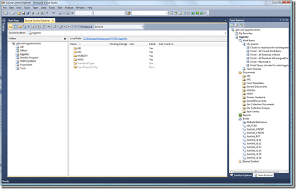

![VS-TS_rgb_thumb[2][5][5][5]](images/ConnectingVS2010toTFS2008_EA90-VSTS_rgb_thumb2555-4-4.png)Connecting Visual Studio 2010 to Team Foundation Server 2008 is a snitch… If you have done it from VS200x to TFS200x then you will have no problems understanding what is going on…
{ .post-img }

{ .post-img }

Unlike previous versions of Team Suit there is not need to install Team Explorer separately as it comes preinstalled.

{ .post-img }

As you can see, when connecting to a TFS 2008 server you can see a single Team Projects collection called “Legacy server”, and a list of your projects. For more information about Project Collections try [Brian Harry’s blog](http://blogs.msdn.com/bharry/archive/2009/04/19/team-foundation-server-2010-key-concepts.aspx). Once Connected you have all the usual suspects, but just a little prettier…

{ .post-img }

Technorati Tags: [ALM](http://technorati.com/tags/ALM) [TFS Admin](http://technorati.com/tags/TFS+Admin) [VS 2010](http://technorati.com/tags/VS+2010) [TFS 2008](http://technorati.com/tags/TFS+2008)
