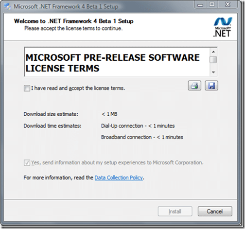
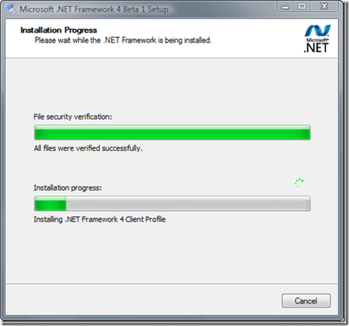

[![VS-TS_rgb_thumb[2][5]](images/Installing.NET4_.0Beta1onWindowsVista64x_E872-VS-TS_rgb_thumb25-3-3.png)](/Users/martihins/AppData/Local/Temp/WindowsLiveWriter1286139640/supfiles16EE3EF/VS-TS_rgb%5B4%5D.png)Today we see the first beta release of Microsoft's latest version of the .NET Framework. I will document the install process here, because well, some people just need assurances that it works ;)
{ .post-img }

Microsoft are adding some excellent features like the Dynamic Language Runtime (DLR) and huge improvements to Domain Specific Languages. There will also be Visual Basic 10 and C# 4 that add a lot of features and bring the two languages closer together in everything except syntax. You can find out more about the exciting features that are adding and the updates to existing features by searching the web, but Lets get to the install…

Just like the previous versions of the .NET Framework, there are really no options on the install… Just accept the licence agreement and install.

{ .post-img }

The install took less than 20 minutes on my computer, which is a big improvement on 3.5! We will need to see how it performs on a virtual environment which I regularly have to leave overnight for a 3.5 install.

{ .post-img }

You can find out what is new in the framework  from these blogs:

[http://msmvps.com/blogs/kathleen/archive/2009/01/07/the-most-important-feature-of-net-4-0.aspx](http://msmvps.com/blogs/kathleen/archive/2009/01/07/the-most-important-feature-of-net-4-0.aspx "http://msmvps.com/blogs/kathleen/archive/2009/01/07/the-most-important-feature-of-net-4-0.aspx")

[http://blogs.msdn.com/wenlong/archive/2008/09/07/net-4-0-wf-wcf-and-oslo.aspx](http://blogs.msdn.com/wenlong/archive/2008/09/07/net-4-0-wf-wcf-and-oslo.aspx "http://blogs.msdn.com/wenlong/archive/2008/09/07/net-4-0-wf-wcf-and-oslo.aspx")

Technorati Tags: [.NET](http://technorati.com/tags/.NET) [Windows](http://technorati.com/tags/Windows)
