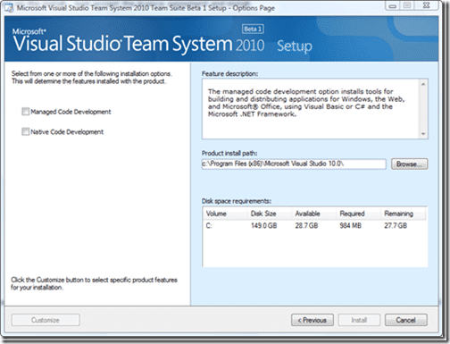
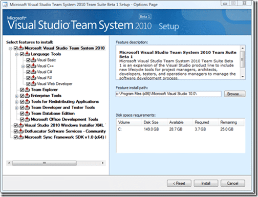

![VS-TS_rgb_thumb[2]](images/InstallingVisualStudio2010TeamSuitBeta1_EA00-VSTS_rgb_thumb2-8-8.png)It’s here, [Visual Studio 2010 Beta 1](http://www.microsoft.com/visualstudio/en-gb/products/2010/default.mspx). This is probably the most exciting product to come out of Microsoft since…well… Visual Studio 2008 ;).
{ .post-img }

{ .post-img }

The install will be totally familiar to those of you that have installed Visual Studio before, but you will note that there are no options like we had before where we could choose which components we want installed.

{ .post-img }

What we do get is the option to install for Managed or Native or both, this makes it easier for the those of us who just want all of the bits for the “thing” that we do.

{ .post-img }

You can, however click “Customize” at the bottom of the page to see the usual bits that, lets be honest, hardly any of us will use :)

{ .post-img }

I will be doing a full install by ticking both “Managed” and “Native” to get the works…Once you kick off the install you get a much nicer progress tracker.

 
{ .post-img }

The install took around 30 minutes, also a big improvement over previous versions, And you are done.

{ .post-img }

And what does the new welcome page look like?

{ .post-img }

Mmmmmm…

Technorati Tags: [ALM](http://technorati.com/tags/ALM) [.NET](http://technorati.com/tags/.NET) [TFS Admin](http://technorati.com/tags/TFS+Admin) [VS 2010](http://technorati.com/tags/VS+2010) [VS 2008](http://technorati.com/tags/VS+2008)
