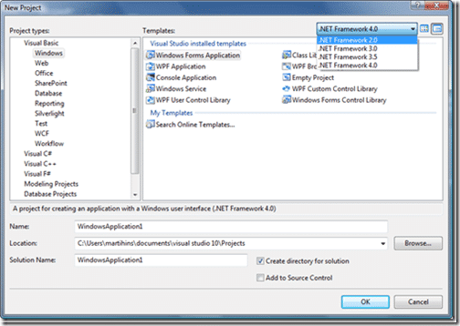

![VS-TS_rgb_thumb[2][5][5][5]](images/MultiTargetinginVisualStudio2010_EBFB-VSTS_rgb_thumb2555-4-4.png)We thought that we had it good in Visual Studio 2008, being able to target .NET 2.0, 3.0 and 3.5, but in reality they were all running on the .NET 2.0 Runtime, just with a different set of available libraries. Well Visual Studio 2010 take it that little bit further by being able to target .NET 2.0, 3.0, 3.5 and 4.0.
{ .post-img }

{ .post-img }

This will be an invaluable feature as, if it turns out to be stable enough, you will be able to build or work on your existing 2.0 Runtime application and websites in Visual Studio 2010. One feature that I was disappointed to see missing is the ability to open project files in both Visual Studio 2008 and Visual Studio 2010 simultaneously, that way you could move some of your developers over to 2010 and have the rest on 2008 on the same project…

But I guess we can’t have everything, and some features will be dropped for the sake of actually getting a product finished…

Well done to the Product teams for this mammoth feet…
{ .post-img }

Technorati Tags: [ALM](http://technorati.com/tags/ALM) [.NET](http://technorati.com/tags/.NET) [Developing](http://technorati.com/tags/Developing) [VS 2010](http://technorati.com/tags/VS+2010) [VS 2008](http://technorati.com/tags/VS+2008)
