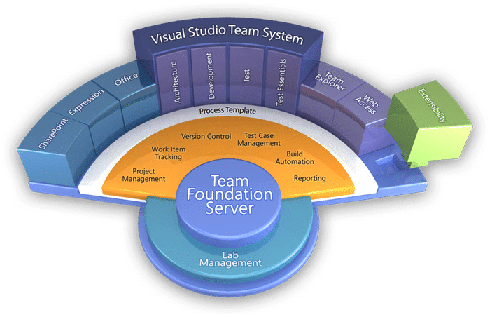

[Visual Studio 2010 Team Suit Beta 1](http://www.microsoft.com/visualstudio/en-gb/products/2010/default.mspx) and [Visual Studio 2010 Team Foundation Server Beta 1](http://www.microsoft.com/visualstudio/en-gb/products/2010/default.mspx) will be available to download from MSDN today at 5pm (GMT) and to the general public on Wednesday.

[![VS-TS_rgb_thumb[2][5][5]](images/VisualStudioTeamSystem2010Beta1Ships_E798-VS-TS_rgb_thumb255-1-1.png)](/Users/martihins/AppData/Local/Temp/WindowsLiveWriter1286139640/supfiles16FBFDC/VS-TS_rgb%5B4%5D.png)
{ .post-img }

{ .post-img }

As you can see from this, there are more pieces to the 2010 puzzle, here is a list from [Brian Harry’s blog](http://blogs.msdn.com/bharry/archive/2009/04/08/team-system-2010-overview.aspx):

Architecture ([http://blogs.msdn.com/camerons/](http://blogs.msdn.com/camerons/))

- Architecture Explorer
- Layer diagram
- Use case designer
- Activity designer
- Component diagram
- Logical class designer
- Sequence diagram
- Modelling project system
- UML Model explorer
- Architecture validation during build

Development & Database ([http://blogs.msdn.com/habibh/](http://blogs.msdn.com/habibh/))

- Historical debugging
- Test impact analysis
- Improved code analysis
- Improved profiling (especially multi-tier)
- Database extensibility

Lab Management ([http://blogs.msdn.com/amit_chatterjee](http://blogs.msdn.com/amit_chatterjee), [http://blogs.msdn.com/lab_management](http://blogs.msdn.com/lab_management))

- Multi-tier Environment creation and management
- Automated deployment
- Easily manage machine pools
- Network fencing
- Checkpoints

Test ([http://blogs.msdn.com/amit_chatterjee](http://blogs.msdn.com/amit_chatterjee), [http://blogs.msdn.com/james_whittaker](http://blogs.msdn.com/james_whittaker))

- Test planning
- Test case management
- Test prioritization
- Run management & reporting
- Project quality reports
- Manual test execution
- Diagnostic recording (environment, video, etc)
- UI Automation recording
- Coded UI tests

TFS (my blog [http://blogs.msdn.com/bharry](http://blogs.msdn.com/bharry))

- Work item hierarchy & linking
- Improved Agile template
- MOSS & WSS Dashboards
- Simplified reporting
- Improved support for parallel development
- Rollback
- Build queuing and pooling
- Gated checkin
- Simplified setup
- Scale out of web and data tiers
- Admin console
- Project move/archive/restore

I will also add to that..

New WPF UI:

[Jason Zander](http://blogs.msdn.com/jasonz) on

[A New Look for Visual Studio 2010](http://blogs.msdn.com/jasonz/archive/2009/02/20/a-new-look-for-visual-studio-2010.aspx) and

[VS2010: On Triangles and Performance](http://blogs.msdn.com/jasonz/archive/2009/05/12/vs2010-on-triangles-and-performance.aspx)

Technorati Tags: [ALM](http://technorati.com/tags/ALM) [.NET](http://technorati.com/tags/.NET) [TFS Custom](http://technorati.com/tags/TFS+Custom) [TFBS](http://technorati.com/tags/TFBS) [Testing](http://technorati.com/tags/Testing) [TFS Admin](http://technorati.com/tags/TFS+Admin) [Version Control](http://technorati.com/tags/Version+Control) [Design](http://technorati.com/tags/Design) [WIT](http://technorati.com/tags/WIT) [Developing](http://technorati.com/tags/Developing) [Visual Studio](http://technorati.com/tags/Visual+Studio) [WPF](http://technorati.com/tags/WPF) [MOSS](http://technorati.com/tags/MOSS) [VS 2010](http://technorati.com/tags/VS+2010) [SharePoint](http://technorati.com/tags/SharePoint)
