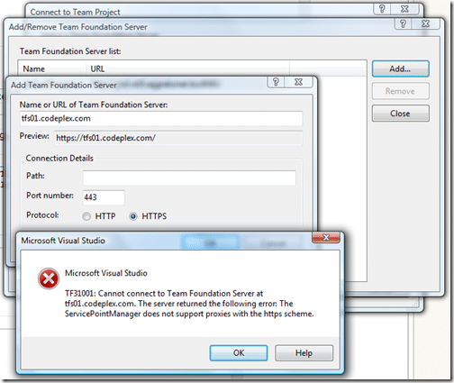

I have a number of [CodePlex](http://www.codeplex.com "CodePlex") projects that I connect to from work and I have had a problem since 2008 that it does not always send my authentication to the proxy server (ISA). What this manifests as is that I get a popup telling me that “Proxy authentication is required”. The workaround was to connect in offline and then click the connect button and everything invariable works with no additional problems.

With Visual Studio 2010 the mater is slightly different. It pops up with a vague error that I had not seen before, but a little searching seamed to indicate that it may be the proxy problem rearing its ugly head in a killer way.

{ .post-img }

So the “ServicePointManager does not support proxies with the https scheme” error has been seen before when connecting to [Windows Communication Foundation](http://wcf.netfx3.com "Windows Communication Foundation") services through a proxies. The fix is code based, so that is not something that I can achieve, so I have raised a [bug](https://connect.microsoft.com/VisualStudio/feedback/ViewFeedback.aspx?FeedbackID=453677) on Connect.

If you are experiencing this problem, then please add your support to the work item:

[BUG: Unable to connect to TFS using HTTPS over the Internet from behind ISA](https://connect.microsoft.com/VisualStudio/feedback/ViewFeedback.aspx?FeedbackID=453677)

Technorati Tags: [ALM](http://technorati.com/tags/ALM) [VS 2010](http://technorati.com/tags/VS+2010)
