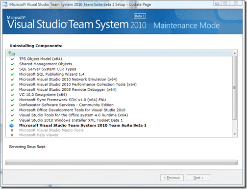
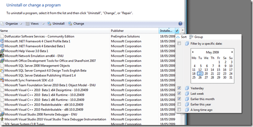
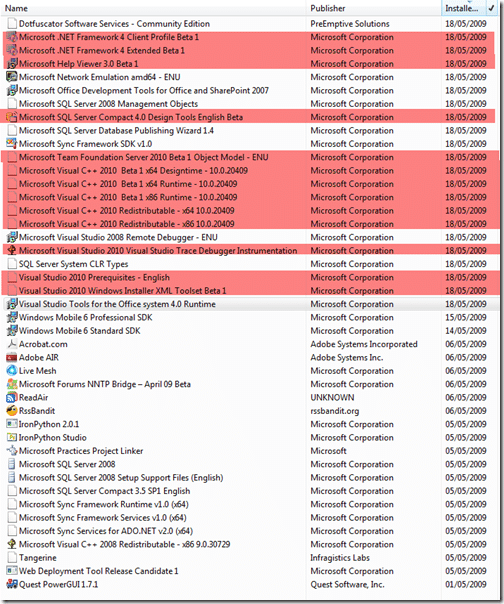
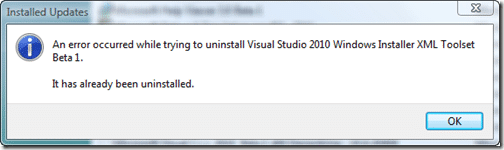
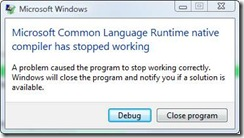

You may think, why is he uninstalling VS2010? Well, apart from proving that it works…And that it plays well with VS2008 I need to remove the pre-beta beta that I have installed.

{ .post-img }

This is in fact the second time I have uninstalled VS2010 on this computer, and I had no problems last time, but the difference is that I will be installing a slightly different build :) of Beta 1.

I am hoping that I do not have any problems, but my scenario is largely unsupported.

I have removed visual studio, but it probably left a few trainer that I will need to remove manually. The easiest way is to see what was installed in the last month and check it all… Gruelling I know, but what can you do…

There is a nice little feature in Vista when you are in the programs list that lets you filter the list… coz it can be realy big

{ .post-img }

Here is he list of software I have installed in the last month:

{ .post-img }

I have highlighted all of the 2010 bits and it at first seams like there are rather a lot of them, but as you go through the list (I will finish with the .NET 4.0 bits) you find that it is just a cleanup issue..

{ .post-img }

So I then had some fun uninstalling .NET 4.0…

I know that this was unsupported, and that we were warned us not to do it, but we are developers and we like to push the big red buttons, but I installed the pre-beta beta on my production computer…

During the uninstall there was an infinite number of runtime errors.

{ .post-img }

And after cancelling and rebooting received lots of .net 4.0 errors for all sorts of applications upon boot.

{ .post-img }

The same thing happened during my second attempt at uninstalling. The plan now is to try a repair and then an uninstall...

Well, the repair failed, so I am going strait to installing from the new .NET 4.0 Beta 1 release and everything seams to be working ok so far. I realise that my computer will be in an unknown state afterwards, but I can always reinstall when I get the chance.

{ .post-img }

And after a restart, no problems… Wohooo….

Now to VS2010… And if my infrastructure team get me my VPC there will be [TFS](http://msdn2.microsoft.com/en-us/teamsystem/aa718934.aspx "Team Foundation Server") fun as Well.

So the end result is that although I have not uninstalled .NET 4.0, I do have the latest version which is what I wanted…

Technorati Tags: [ALM](http://technorati.com/tags/ALM) [.NET](http://technorati.com/tags/.NET) [VS 2010](http://technorati.com/tags/VS+2010) [VS 2008](http://technorati.com/tags/VS+2008)
