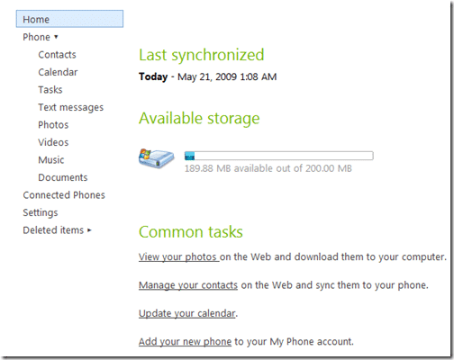

Microsoft recently opened up there beta of the MyPhone service to the general public. The service syncs your Mobile phone with the web and allows access to your Contacts Calendar tasks, pictures and more.

{ .post-img }

I have just left it running, but you can add stuff to your phone through this interface as well. I see the bonus of this as a backup, which I kinda have with Plaxo.com already for my contacts and calendar, but having your pictures and video up there too is much easier than connecting your phone into the computer.

I do not know what the bandwidth is like, but the fact that you cant set the sync any more frequently than once a day is an indication that it must be intensive. Make sure that you have a good hold of your data tariff for this one (I have unlimited for £9 from Orange), but for a beta it is a pretty cool service. I would like to see it integrated with SkyDrive for storage and a roll up of all these bits into [http://home.live.com…we](http://home.live.com…we) can but hope.

Setup you phone by going to [http://myphone.microsoft.com](http://myphone.microsoft.com "http://myphone.microsoft.com")

Technorati Tags: [Personal](http://technorati.com/tags/Personal) [WM6](http://technorati.com/tags/WM6)
