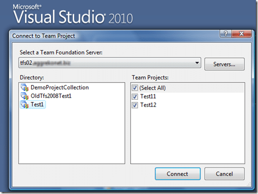
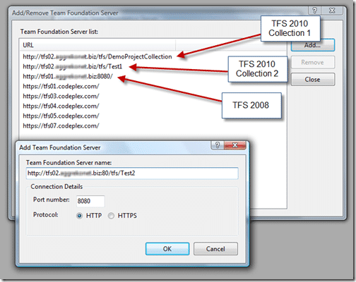

Easy peasy, all you need is the full URL from the project collection and you will be able to connect directly to it as if it was a different Team Server. This functionality was added with Visual Studio 2008 Service Pack 1, so if you don’t have SP1 installed yet you had better get it:

[Microsoft Visual Studio 2008 Service Pack 1](http://www.microsoft.com/downloads/details.aspx?FamilyId=FBEE1648-7106-44A7-9649-6D9F6D58056E&displaylang=en "Microsoft Visual Studio 2008 Service Pack 1")

You need to use the following in the connection box “http://\[tfsserver\]:\[port\]/\[vdir\]/\[projectCollection\]

Although this looks complicated, it makes some sense at least, but is nowhere as nice as using the 2010 connection box:

{ .post-img }

One of the new things in [TFS](http://msdn2.microsoft.com/en-us/teamsystem/aa718934.aspx "Team Foundation Server") 2010 is that you can specify a virtual directory that it will run under, the default being “tfs” so you can have everything on the same ports.

So, if your tfs server name is “tfs01.domainname.com” and you take the default vdir of “tfs”, all you need is the collection name. So you could end up with “http://tfs01.domainname.com:80/tfs/MyNewCollection”

{ .post-img }

Backward compatibility +1

Connecting from Visual Studio 2005 Service Pack 1 is a different story, there is currently no way to connect VS2005 to TFS2010. There has been some discussion around this and its importance to Business Intelligence teams. If you are just opening VS2005/VS2003 occasionally then you could probably get away with using 2010 to control TFS and working in 2005, but many BI developers are still spending a considerable amount of there time in 2005 :(

Technorati Tags: [ALM](http://technorati.com/tags/ALM) [TFS Admin](http://technorati.com/tags/TFS+Admin) [VS 2008](http://technorati.com/tags/VS+2008) [TFS 2010](http://technorati.com/tags/TFS+2010) [TFS](http://technorati.com/tags/TFS) [VS 2005](http://technorati.com/tags/VS+2005)
