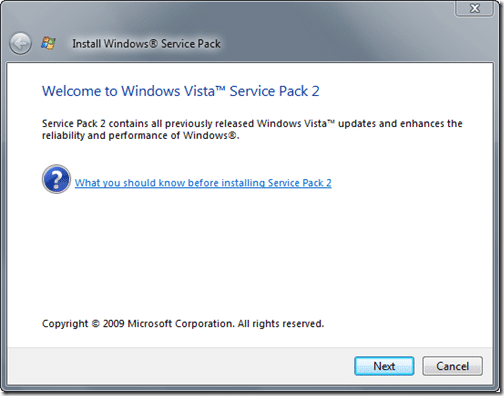
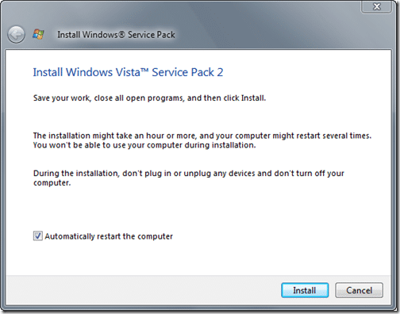

If, like me, you are stuck with the old and decrepit version of Windows that is Vista SP1 at work then you may be interested in Service Pack 2 which became available on the MS Download site today.

[Windows Server 2008 Service Pack 2 and Windows Vista Service Pack 2 - Five Language Standalone (KB948465)](http://www.microsoft.com/downloads/details.aspx?FamilyID=a4dd31d5-f907-4406-9012-a5c3199ea2b3&DisplayLang=en)

[Windows Server 2008 Service Pack 2 and Windows Vista Service Pack 2 - Five Language Standalone for x64-based systems (KB948465)](http://www.microsoft.com/downloads/details.aspx?FamilyID=656c9d4a-55ec-4972-a0d7-b1a6fedf51a7&DisplayLang=en)

I am not saying that I would rather have XP, but even with my work development computer ( 8 cores, 4gb rams, 2x 10000rpm raptors, raid 0+1) I find that it is sometimes a struggle finding some resources with which to run Visual Studio…

{ .post-img }

{ .post-img }

{ .post-img }

For me this is not a lot, and I have more running on my wife's laptop (2 cores, 4gb ram, 5400rpm HDD) with less problems on Windows 7 RC. I am not saying that Windows 7 uses less resources, but it certainly makes better use of them…

Well, lets hope SP2 solves at least some of these problems…

{ .post-img }

Ominous…

{ .post-img }

I think as usual with Vista only Part 1 of 3 will be done while I can still work… with part 2 on shutdown and 3 on reboot…

{ .post-img }

You can find out loads about what is in it from:

[Windows Vista SP2 RTM + Windows Vista SP1 Blocker Tool Removed](http://windowsteamblog.com/blogs/windowsvista/archive/2009/04/28/windows-vista-sp2-rtm-windows-vista-sp1-blocker-tool-removed.aspx "http://windowsteamblog.com/blogs/windowsvista/archive/2009/04/28/windows-vista-sp2-rtm-windows-vista-sp1-blocker-tool-removed.aspx")

Hopefully this will work…

Technorati Tags: [Windows](http://technorati.com/tags/Windows)
