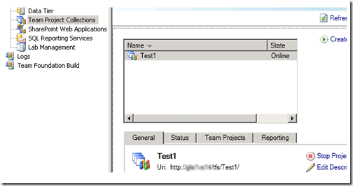
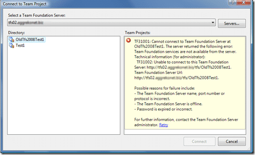

I have just finished installing [TFS](http://msdn2.microsoft.com/en-us/teamsystem/aa718934.aspx "Team Foundation Server") 2010 beta 1 and doing an upgrade of out TFS 2008 data. This did not go well…

Due to a collation mismatch between my original SQL Server 2005 and my new SQL Server 2008 I received an error when upgrading…

> \[Error  @13:57:23.665\] TF255184: An error occurred during operation.  Message=Cannot resolve the collation conflict between "SQL_Latin1_General_CP1_CI_AS" and "Latin1_General_CI_AS" in the equal to operation.  
> Transaction count after EXECUTE indicates a mismatching number of BEGIN and COMMIT statements. Previous count = 0, current count = 1.. Exception=.  
> \[Error  @13:57:23.681\] TF254026: An error occurred during the following operation: Upgrade. The error occurred during the following step group: Upgrade.TfsTeamBuild. It occurred on the following step: Check In Build Process Templates. The following message was returned: Cannot resolve the collation conflict between "SQL_Latin1_General_CP1_CI_AS" and "Latin1_General_CI_AS" in the equal to operation.  
> Transaction count after EXECUTE indicates a mismatching number of BEGIN and COMMIT statements. Previous count = 0, current count = 1..  
> \[Info   @13:57:23.681\] CollectionServicingMonitor - \[5/25/2009 2:56:55 PM\] Servicing step Check In Build Process Templates failed. (ServicingOperation: Upgrade; Step group: Upgrade.TfsTeamBuild)

And then the roll back of the transaction did not quite work as expected, so although the TFS Administration does not know about my OldTfs2008Test1 project collection.

{ .post-img }

My client has it listed but with a TF31001 error.…

{ .post-img }

Solution? Suck it up and reinstall everything, including SQL and change the collation to the same on both servers. :(

Technorati Tags: [ALM](http://technorati.com/tags/ALM) [TFS 2010](http://technorati.com/tags/TFS+2010) [TFS 2008](http://technorati.com/tags/TFS+2008)
