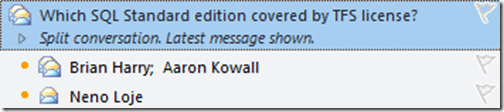

Hey, well the dentist was fun! And I have had time to install Office 2010 on my wife's Windows 7 laptop. I will try to put together some of the interesting features…

This is nice. Much better than the Google Mail one and is starting to make more sense the more I use it. I am connecting to my Google Mail via IMAP and this example illustrates the feature nicely.

{ .post-img }

Here is a conversation that has three emails. Aaron sent the first message and both Brian and Neno replied. It shows Brian and Aaron’s email  on the same line because Brian’s email is the most recent in the conversation. But Neno also replied and thus it is a split conversation. Think of it like a wee tree with Aaron’s email having 2 branches with Brian’s email being the latest. If you leave it rolled up you never see Aaron’s email, just the latest with the trail in it. This both minimizes the number of emails you have to read, and groups them together so you can follow the conversation.

{ .post-img }

If you open it out, it shows all three emails, with the replies with the little dots.

Here is an example when all of the replies come in order.

{ .post-img }

And expanded

{ .post-img }

Like I said… Nice…

Technorati Tags: [Office](http://technorati.com/tags/Office)
