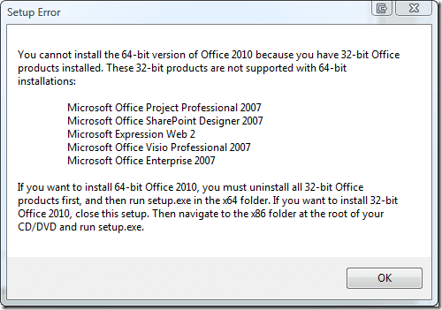

I am installing office 2010, and I ran into my first gotcha!

I have a 64 bit computer and I wanted to use the 64bit version of Office, but there is no upgrade option for this, you need to uninstall Office 2007 32bit (the only version there is) and put the 64bit on… Here is the message…

{ .post-img }

This sucks a little, and will suck even more if I can’t keep my settings. Mainly for Outlook, and why I need to uninstall Expression Studio Web I do not know, it may be due to some integration for creating html emails…

This will be a 64 bit adoption blocker for companies as this will be difficult to automate…

I think with the prevalence of 64bit hardware, the release of Windows 7, and the RAM now coming as standard in new computers getting above 3.5GB there will be a lot more 64 bit upgrades and this needs to be looked at… I don’t know if it is possible, but can’t the install just uninstall my previous versions? Maybe this is just a Technology Preview limitation…

Technorati Tags: [Windows](http://technorati.com/tags/Windows) [Office](http://technorati.com/tags/Office)
