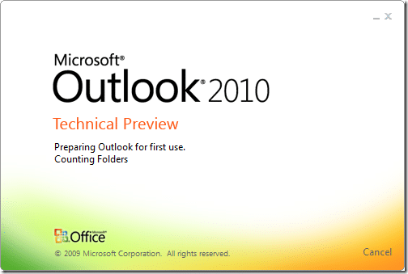

I will need to be quick, I have a dentists appointment (arg!), but I could not leave without at least a peek at Office 2010, so Outlook being my weapon of necessity, that the choice:

{ .post-img }

You can’s see it from a still, but those colours are dancing about, and I just caught a glimpse of the magic words “Importing user settings”… I am a happy man…

So, its smile time…

{ .post-img }

I think this form of feedback is both informal and excellent for encouraging user participation…

Usual activation…

{ .post-img }

Woo, when you select an email you get a nice little tasks list, just what I wanted.

{ .post-img }

Nice… It does a little conversation stuff and from what I can see its a LOT better than Google… When will this functionality hit Live Mail I wonder…

{ .post-img }

Well, its dentist time, so that's all I have time for… Will try to install on Windows 7 tonight…

Technorati Tags: [Windows](http://technorati.com/tags/Windows) [Office](http://technorati.com/tags/Office)
