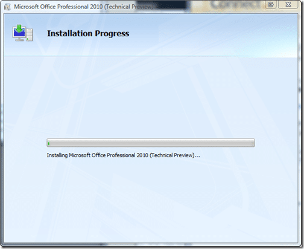
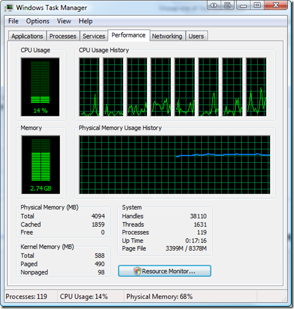

Now I have [uninstalled Office 2007 32bit](http://blog.hinshelwood.com/archive/2009/07/16/installing-office-2010-gotcha-1.aspx) I am ready to get this 2010 thing going…

I am installing on Vista 64, I know, but I cant get Windows 7 in the office yet…

{ .post-img }

I always do a full install, coz I really hate not having that feature that you need that you did not know that you need ;)

{ .post-img }

{ .post-img }

Now, although I am not using very much of the resources on my computer, the install seems to be making it relatively unresponsive.

 
{ .post-img }

Not a big deal, but Visual Studio can be unresponsive anyway…so…where did all my productivity go :(

{ .post-img }

Woo, little smiles:

 
{ .post-img }
{ .post-img }

Technorati Tags: [Windows](http://technorati.com/tags/Windows) [Office](http://technorati.com/tags/Office)
