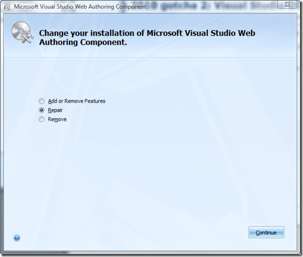

I am having a little problem with Visual Studio 2008 that only started after I had installed Office 2010. I found this interesting post on [Visual Studio 2008 Locks or Freezes in ASPX](http://abdullin.com/journal/2009/5/12/visual-studio-2008-locks-or-freezes-in-aspx.html) from [Rinat Abdullin](http://abdullin.com/) that was a complete match to the problem I am having.

Basically VS just bings at you whenever you click anywhere as if there is a model dialog open after opening and trying to edit an aspx file.

If you get this problem then there is a simple solution, well, one that worked for me. You need to run a repair on the “Microsoft Visual Studio Web Authoring Component” that is part of Office 2007.

{ .post-img }

You can find the setup in the following locations:

> **Windows 64bit**
>
> C:Program Files (x86)Common Filesmicrosoft sharedOFFICE12Office Setup ControllerSetup.exe
>
> **Windows 32bit**
>
> C:Program FilesCommon Filesmicrosoft sharedOFFICE12Office Setup ControllerSetup.exe

My guess is that when Office 2010 is installed it has a new version of this component that has not yet been made compatible with Visual Studio 2008…

It was a frustrating couple of hours this morning to figure it out with the bulk of the time taken up with an ineffectual repair of Visual Studio 2008 SP1, ahh well, now I know…

Technorati Tags: [ALM](http://technorati.com/tags/ALM) [Office](http://technorati.com/tags/Office) [TFS Admin](http://technorati.com/tags/TFS+Admin) [VS 2008](http://technorati.com/tags/VS+2008)
