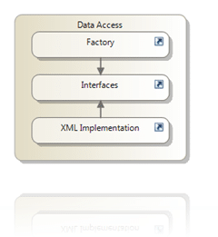
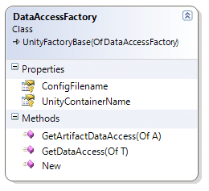

I am always pulling out the Unity assemblies. Maybe it is just because I am lazy, but I really can’t be bothered rolling my own dependency injection and mapping framework!


{ .post-img }

I am going to use Unity only as a mapping frame work for now, I want to be able to pass an Interface into a method, and get back the correct data access class.

The plan is to meet the diagram on the left. Only the factory and the interfaces are accessible, but are all set to “friend” which will require an assembly tag to be added to both the Factory and the Interfaces assemblies to allow explicit access.

```
<Assembly: InternalsVisibleTo("Hinshlabs.TfsDynamicPolicy.Services.Server")>
```

This allows classes in the named assembly to access all classes and methods that have been prefaced with the “Friend” access level. Its a sneaky way of helping to maintain your layer integrity. So with this reference added only the Services.Server assembly, the one with the web service implementation, can access the factory and the interfaces, making them un-callable from any other assembly.

note: if you use only the assembly’s friendly name and not the explicit signed name then someone could just create an assembly of the same name as above and they will be able to call as if they were Services.Server. This is not to prevent hacking, just those pesky developers (me) who may try to bypass the service tier…

If, like me you are running tests you will also need to add an InternalsVisibleTo entry for your test assemblies or you will be plagued by “Assessors”..

First is my IDataAccess class, this is really only exists so there is some validation on my generics.

[](http://blog.hinshelwood.com/files/2011/05/GWB-WindowsLiveWriter-CreatingaDataAccesslayerusingUnity_E289-image34.png)
{ .post-img }

```
' Assembly: Hinshlabs.TfsDynamicPolicy.DataAccess.Common
Public Interface IDataAccess

End Interface
```

I also have a more specific Interface that allows for the loading of Artefacts. I have not yet implemented anything more than get and add, but you can see that it inherits (yes an interface and inherits in the same sentence) from the IDataAccess interface so we can pass it as a generic type that complies with IDataAccess.

```
'Assembly: Hinshlabs.TfsDynamicPolicy.DataAccess.Common
Imports Hinshlabs.TfsDynamicPolicy.Common

Public Interface IArtifactDataAccess(Of T As Artifact)
    Inherits IDataAccess

    Function GetArtifact(ByVal id As Guid) As T
    Function GetArtifact(ByVal Uri As Uri) As T
    Function GetArtifacts() As ArtifactCollection
    Function AddArtifact(ByVal artifact As T) As Boolean

End Interface
```

Wow… that was hard, IDataAccess may have a little more than nothing in the future, but for now that is it. Now, what I need is a class that I can inherit from that will provide the functionality I need for any factory. This is mainly coz factories bread factories.


{ .post-img }

```
'Assembly: Hinshlabs.TfsDynamicPolicy.Common
Imports System.IO
Imports System.Globalization
Imports System.Xml.Serialization
Imports System.Configuration
Imports Microsoft.Practices.Unity
Imports Microsoft.Practices.Unity.Configuration
Imports Hinshlabs.TfsDynamicPolicy.Common
Imports System.Reflection

Friend MustInherit Class UnityFactoryBase(Of T As {New, UnityFactoryBase(Of T)})

#Region " Singleton"

    Private Shared m_Instance As T

    Friend Shared ReadOnly Property Instance As T
        Get
            If m_Instance Is Nothing Then
                m_Instance = New T
                m_Instance.Initialize()
            End If
            Return m_Instance
        End Get
    End Property

    Protected Sub New()
        ' Do nothing in here
    End Sub

#End Region

    Private m_UnityContainer As IUnityContainer

    Private Sub Initialize()
        ' Create Unity container
        m_UnityContainer = New UnityContainer()
        ' Configure Unity
        Dim config As Configuration
        Dim fm As New ExeConfigurationFileMap

        fm.ExeConfigFilename = ConfigFilename
        Dim configFileLocation As String = Path.Combine(Path.GetDirectoryName(Assembly.GetCallingAssembly.Location), ConfigFilename)
        If Not File.Exists(configFileLocation) Then
            Throw New FileNotFoundException(String.Format(CultureInfo.InvariantCulture, "Unable to load config file with the name {0}", fm.ExeConfigFilename), configFileLocation)
        End If
        config = ConfigurationManager.OpenMappedExeConfiguration(fm, ConfigurationUserLevel.None)
        Dim section As UnityConfigurationSection = CType(config.GetSection("unity"), UnityConfigurationSection)
        If section Is Nothing Then
            Throw New AccessViolationException(String.Format(CultureInfo.InvariantCulture, "There is no unity section called {0} in the config file {1}", UnityContainerName, ConfigFilename))
        End If
        section.Containers(UnityContainerName).Configure(m_UnityContainer)
    End Sub

    Protected ReadOnly Property UnityContainer As IUnityContainer
        Get
            Return m_UnityContainer
        End Get
    End Property

    Protected MustOverride ReadOnly Property UnityContainerName As String
    Protected MustOverride ReadOnly Property ConfigFilename As String

End Class
```

The UnityFactoryBase class provides a couple of features. It provides a Singleton pattern so that we make sure that there is only ever one instance per factory type T and we initialise a UnityContainer for each Instance of factory T. You can see that on the class definition the generic type T that will be passed in is of the same type as the class itself. This makes sure that the class that represents T inherits from UnityFactoryBase(Of T As {New, UnityFactoryBase(Of T)}). When configuring the Unity Container we get both the container name and the config file to load from the child class. This allows for both different config files per factory and the option to have a single config file and multiple unity configuration elements. Its up to you…

We need to inherit from UnityFactoryBase(Of T As {New, UnityFactoryBase(Of T)})  to create our factory and provide a config file to configure the UnityContainer. The inherited class is pretty simple as we have done most of the heavy lifting in the base class.


{ .post-img }

```
Imports Hinshlabs.TfsDynamicPolicy.DataAccess.Common
' Assembly: Hinshlabs.TfsDynamicPolicy.DataAccess
Imports Hinshlabs.TfsDynamicPolicy.Common
Imports System.Globalization

Friend Class DataAccessFactory
    Inherits UnityFactoryBase(Of DataAccessFactory)

    Public Sub New()
        ' Do nothing in here
    End Sub

    Protected Overrides ReadOnly Property UnityContainerName As String
        Get
            Return "DataAccess"
        End Get
    End Property

    Protected Overrides ReadOnly Property ConfigFilename As String
        Get
            Return String.Format(CultureInfo.InvariantCulture, "{0}.Unity.config", System.Reflection.Assembly.GetExecutingAssembly().GetName.Name)
        End Get
    End Property

    Public Function GetDataAccess(Of T As IDataAccess)() As T
        Return UnityContainer.Resolve(Of T)()
    End Function

End Class
```

The DataAccessFactory provides the data needed by the UnityFactoryBase(Of DataAccessFactory) as well as the method that I need to retrieve an IDataAccess class. I will show you how it is called, but first there is the little matter of config:

```
<?xml version="1.0" encoding="utf-8" ?>
<configuration>
  <configSections>
    <section name="unity" type="Microsoft.Practices.Unity.Configuration.UnityConfigurationSection, Microsoft.Practices.Unity.Configuration" />
  </configSections>
  <unity>
    <typeAliases>
      <!-- Lifetime manager types should be inserted if you need lifetime managers -->
      <typeAlias alias="singleton" type="Microsoft.Practices.Unity.ContainerControlledLifetimeManager, Microsoft.Practices.Unity" />
      <typeAlias alias="external" type="Microsoft.Practices.Unity.ExternallyControlledLifetimeManager, Microsoft.Practices.Unity" />
      <!-- User defined type aliases -->
      <!-- An interface for artifact data access implementation -->
      <typeAlias alias="IArtifactDataAccess`1" type="Hinshlabs.TfsDynamicPolicy.DataAccess.Common.IArtifactDataAccess`1, Hinshlabs.TfsDynamicPolicy.DataAccess.Common" />
    </typeAliases>
    <containers>
      <container name="DataAccess">
        <types>
          <!-- Lifetime managers specified using the type aliases -->
          <type type="IArtifactDataAccess`1" mapTo="Hinshlabs.TfsDynamicPolicy.DataAccess.Xml.ArtifactDataAccess`1, Hinshlabs.TfsDynamicPolicy.DataAccess.Xml">
            <lifetime type="singleton" />
          </type>
        </types>
      </container>
    </containers>
  </unity>
</configuration>
```

I am not going to explain the config file as it is well (ish) documented, but it effectively mapped all generic calls to retrieve IArtifactDataAccess\`1 to the implementation in the XML assembly of ArtifactDataAccess\`1 and makes the resultant object a singleton.

To call this lovely package after you have populated it with many many DataAccess goodies all you need to do is this:

```
Dim dal As IArtifactDataAccess(Of DynamicPolicy) = DataAccessFactory.Instance.GetDataAccess(Of IArtifactDataAccess(Of DynamicPolicy))()
```

Lovely and simple, and to add a new implementation all I need is an Interface like IArtifactDataAccess.. lets call it IHypotheticalDataBits, a concrete implementation… lets call it HypoDataFromTwitter and a mapping in the config file:

```
<type type="IHypotheticalDataBits" mapTo="Hinshlabs.TfsDynamicPolicy.DataAccess.Xml.HypoDataFromTwitter, Hinshlabs.TfsDynamicPolicy.DataAccess.Xml">
  <lifetime type="singleton" />
</type>
```

And you can then call:

```
Dim dal As IHypotheticalDataBits = DataAccessFactory.Instance.GetDataAccess(Of IHypotheticalDataBits)()
```

Any easier and it would be writing for you :)

Technorati Tags: [.NET](http://technorati.com/tags/.NET) [Developing](http://technorati.com/tags/Developing) [Version Control](http://technorati.com/tags/Version+Control) [CodeProject](http://technorati.com/tags/CodeProject)
