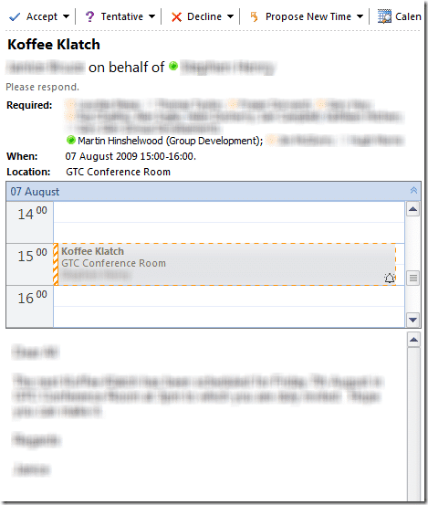

Another nice feature of Outlook 2010 that I like is the Calendar preview:

{ .post-img }

Very effective for seeing quickly wither you can attend :)

Technorati Tags: [Office](http://technorati.com/tags/Office)
