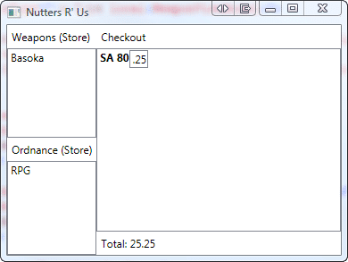
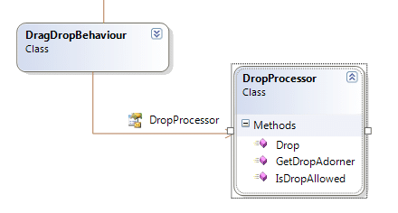
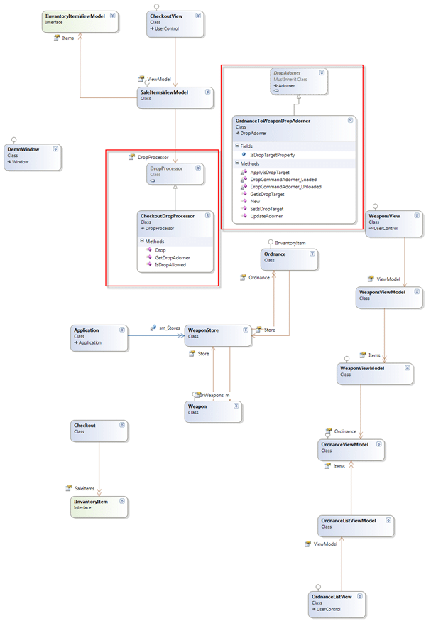

A colleague of mine was having a bit of trouble getting drag and drop working in a way that fitted well with the MVVM pattern. This is really quite simple once you have a certain level of understanding of Patterns, but is a complete nightmare if you do not.

One of the founding principals of MVVM is that you should never be writing code in your code behind, it should all be encapsulated away and be bindable in XAML to achieve the result. Anyone who has tackled drag and drip will have suddenly found their code behind covered in code for handling both the drag and the drop, and multiplied up when dealing with multiple controls.

I cruised the web for information, of which I found plenty and settled on an example by [Bea Stollnitz](http://www.beacosta.com "Bea Stollnitz on Silverlight and WPF") of Microsoft. In her [post](http://www.beacosta.com/blog/?p=53 "How can I drag and drop items between data bound ItemsControls?") i had found one of the best and most intuitive examples of the Drag & Drop Behaviour written in C#.

I am not going to go into all of her code which she has available for download, just to say that it is nice, and is exactly what I am looking for even with the limitations that she described.

The functionality available allows you to drag a piece of data from one ItemsControl to another of the same data type or to reorder within itself. It provides for a floating template for the dragging item and a visual cue for the drop location.


{ .post-img }

I wanted to augment this to allow for other scenarios while keeping as much functionality as possible.

Likes:

- Drag functionality
- Drag templating – nice!
- Encapsulation of logic

Dislikes:

- No way to control drop behaviour

My version lets you inject additional functionality at runtime. The adjusted class diagram shows the relationships, but we only really use the DragDropBehaviour class

 
{ .post-img }

You can still use the standard options:

```
<DockPanel>
    <Label DockPanel.Dock="Top"  Content="Checkout" />
    <ListBox     hlb:DragDropBehaviour.IsDragSource="true"
                 hlb:DragDropBehaviour.IsDropTarget="true"
                 hlb:DragDropBehaviour.DragTemplate="{StaticResource MyTemplate}"
                 ItemsSource="{Binding Items}"
                 MinWidth="100"
                 MinHeight="100"
                 AllowDrop="True"
                 SelectionMode="Multiple">
    </ListBox>
</DockPanel>
```

But I have added another bindable option of DropProcessor that allows you to override the default DropProcessor to achieve whatever you want.

```
<ListBox hlb:DragDropBehaviour.DropProcessor="{Binding DropProcessor}"
    hlb:DragDropBehaviour.IsDragSource="true"
    hlb:DragDropBehaviour.IsDropTarget="true"
    hlb:DragDropBehaviour.DragTemplate="{StaticResource moo}"
    ItemsSource="{Binding Items}"
    MinWidth="100"
    MinHeight="100">
```

In this example I have created a little gun shop called “Nutters R’ Us” where you can buy weapons and ordinance. You can see that there is an area for weapons, and area for ordinance and an area for your selected purchases.


{ .post-img }

I have added a custom DropProcessor only to the Checkout area that only applies when you drop items of type “OrdinanceViewModel”

```
Public Class CheckoutDropProcessor
    Inherits DropProcessor

    Public Overrides Function GetDropAdorner(ByVal behaviour As DragDropBehaviour, ByVal adornerLayer As System.Windows.Documents.AdornerLayer) As DropAdorner
        If TypeOf behaviour.TargetItemContainer.DataContext Is WeaponViewModel Then
            If TypeOf behaviour.SourceItemContainer.DataContext Is OrdnanceViewModel Then
                Return New OrdnanceToWeaponDropAdorner(behaviour, adornerLayer)
            End If
        End If
        Return MyBase.GetDropAdorner(behaviour, adornerLayer)
    End Function

    Public Overrides Function IsDropAllowed(ByVal behaviour As DragDropBehaviour, ByVal draggedItem As Object) As Boolean
        If Not behaviour.SourceItemContainer Is Nothing AndAlso TypeOf behaviour.SourceItemContainer.DataContext Is OrdnanceViewModel Then
            If Not behaviour.TargetItemContainer Is Nothing AndAlso TypeOf behaviour.TargetItemContainer.DataContext Is WeaponViewModel Then
                Return True
            End If
            Return False
        End If
        Return MyBase.IsDropAllowed(behaviour, draggedItem)
    End Function

    Public Overrides Sub Drop(ByVal behaviour As DragDropBehaviour, ByVal draggedItem As Object, ByVal dropEffect As System.Windows.DragDropEffects)
        If Not behaviour.TargetItemContainer Is Nothing AndAlso TypeOf behaviour.TargetItemContainer.DataContext Is WeaponViewModel Then
            If TypeOf behaviour.SourceItemContainer.DataContext Is OrdnanceViewModel Then
                CType(behaviour.TargetItemContainer.DataContext, WeaponViewModel).AddOrdinance(CType(behaviour.SourceItemContainer.DataContext, OrdnanceViewModel))
                Dim indexRemoved As Integer = -1
                If ((dropEffect And DragDropEffects.Move) <> DragDropEffects.None) Then
                    indexRemoved = Utilities.RemoveItemFromItemsControl(behaviour.SourceItemsControl, draggedItem)
                End If
                If (((indexRemoved <> -1) AndAlso (behaviour.SourceItemsControl Is behaviour.TargetItemsControl)) AndAlso (indexRemoved < behaviour.InsertionIndex)) Then
                    behaviour.InsertionIndex -= 1
                End If
                Exit Sub
            End If
        End If
        MyBase.Drop(behaviour, draggedItem, dropEffect)

    End Sub

End Class
```


{ .post-img }

This class inherits from the base class “DropProcessor” that provides the same functionality as the original article, but I have

overridden couple of methods. The first, “GetDropAdorner” test to make sure that you are dropping a OrdinanceViewModel onto a WeaponViewModel and provides a different and custom DropAdorner that instead of providing the lovely insertion visual it just applied a “IsDropTarget” property to the ListBoxItem to allow a template to control the visual. The IsAllowedDrop also test for this case, as does the Drop method. In all cases they are just testing for a special case of Drop and call the base classes methods.

The diagram for the demo app is a little large, but you can see how much I still suck at MVVM, and although I have learned a lot doing this demo, I am still tempted to share ViewModels… but that is a bad habit.


{ .post-img }

I have highlighted the two main classes, and we have already discussed the CheckoutDropProcessor. This allows you the flexibility to augment your drop scenarios without all of your developers having to get too deep in the guts on the behaviour, thus leaving them plenty of time for the real work of actually building something useful.

I have put this [up on Codeplex](http://hinshlabs.codeplex.com/Release/ProjectReleases.aspx?ReleaseId=31504), and both the [source](http://hinshlabs.codeplex.com/Release/ProjectReleases.aspx?ReleaseId=31504#DownloadId=79055) and [binaries](http://hinshlabs.codeplex.com/Release/ProjectReleases.aspx?ReleaseId=31504#DownloadId=79056) are available.

Technorati Tags: [.NET](http://technorati.com/tags/.NET) [WPF](http://technorati.com/tags/WPF) [CodeProject](http://technorati.com/tags/CodeProject) [MVVM](http://technorati.com/tags/MVVM) [Silverlight](http://technorati.com/tags/Silverlight)
