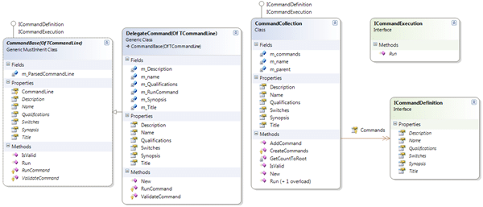
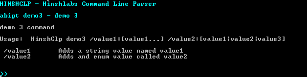

I had previously created a Command Line Parser from [Ray Hayes](http://www.codeproject.com/script/Articles/MemberArticles.aspx?amid=7917) codeproject article [Automatic Command Line Parsing in C#](http://www.codeproject.com/KB/recipes/commandlineparser.aspx). I had adapted it to VB.NET and upgraded it to .NET 3.5 but I recently ran into the problem with wanting a single command prompt application to handle multiple processes and multiple parameters. This would allow you to group all of a particular tasks commands into a single application. With the advent of Power Shell this format is increasingly less relevant, but with the proliferation of Power Shell many people still prefer to use the good old command line.

So, staring from the original [Command Line Parser v1.0](http://hinshlabs.codeplex.com/Release/ProjectReleases.aspx?ReleaseId=28451) code I wanted to be able to add multiple commands, or even nest commands. The result is a nice simple commanding architecture conducive to creating multiple commands.

[](http://blog.hinshelwood.com/files/2011/05/GWB-WindowsLiveWriter-UpdatingtheCommandLineParser_AC5D-image_4.png)
{ .post-img }

Using this model I can create a simple command…

```
Imports Hinshlabs.CommandLineParser
Imports System.IO
Imports System.Collections.ObjectModel
Imports System.Net

Public Class Demo1Command
    Inherits CommandBase(Of Demo1CommandLine)

    Private m_PortalLocation As Uri

    Public Overrides ReadOnly Property Description() As String
        Get
            Return "demo 1 command demonstrates a sinle nested command"
        End Get
    End Property

    Public Overrides ReadOnly Property Name() As String
        Get
            Return "Demo1"
        End Get
    End Property

    Protected Overrides Function ValidateCommand() As Boolean
        Return True
    End Function

    Public Overrides ReadOnly Property Title() As String
        Get
            Return "demo 1"
        End Get
    End Property

    Public Overrides ReadOnly Property Synopsis() As String
        Get
            Return "demo 1 command"
        End Get
    End Property

    Public Overrides ReadOnly Property Switches() As ReadOnlyCollection(Of SwitchInfo)
        Get
            Return CommandLine.Switches
        End Get
    End Property

    Public Overrides ReadOnly Property Qualifications() As String
        Get
            Return String.Empty
        End Get
    End Property

    Protected Overrides Function RunCommand() As Integer
        Try
            CommandOut.Warning("running Demo1")
            Return -1
        Catch ex As Exception
            CommandOut.Error("Failed: {0}", ex.ToString)
            Return -1
        End Try
    End Function

End Class
```

Or something more substantial:

```
Protected Overrides Function RunCommand() As Integer
    Try
        Dim x As New Proxies.MyApp.Configuration.ConfigurationServiceClient("BasicHttpBinding_IConfigurationService", m_PortalLocation.ToString)
        x.ClientCredentials.Windows.AllowedImpersonationLevel = System.Security.Principal.TokenImpersonationLevel.Delegation
        Select Case CommandLine.Action
            Case QuiesceAction.Offline
                x.QuiesceSource(CommandLine.Source, CommandLine.Message, New TimeSpan(0))
            Case QuiesceAction.Online
                x.RestoreSource(CommandLine.Source)
        End Select
        CommandOut.Info("Source {0} has been made {1}", CommandLine.Source, CommandLine.Action.ToString)
        Return 0

    Catch ex As EndpointNotFoundException
        CommandOut.Error("Unable to locate site. Check the value you selected for /Portal:{0}", CommandLine.Portal)
        Return -1
    Catch ex As Exception
        CommandOut.Error("Failed: {0}", ex.ToString)
        Return -1
    End Try
End Function
```

If you are wondering where the variables come from, you can see form Demo1Command that a generic type of Demo1CommandLine is passed in. The application creates an instance of this which wraps the [Ray Hayes](http://www.codeproject.com/script/Articles/MemberArticles.aspx?amid=7917) parser to provide the values from Environment.CommandLine used on the shared methods on the CommandLineBase class.

```
''' <summary>
''' Created a command line object using the Environment.CommandLine information
''' </summary>
''' <typeparam name="TCommandLine">The concrete type of object to create</typeparam>
''' <returns>An instance of the object</returns>
''' <remarks></remarks>
Public Shared Function CreateCommandLine(Of TCommandLine As {New, CommandLineBase})() As TCommandLine
    Return CreateCommandLine(Of TCommandLine)(Environment.CommandLine)
End Function

''' <summary>
''' Created a command line object using the Environment.CommandLine information
''' </summary>
''' <typeparam name="TCommandLine">The concrete type of object to create</typeparam>
''' <param name="CommandLine">The command line arguments to parse</param>
''' <returns></returns>
''' <remarks></remarks>
Public Shared Function CreateCommandLine(Of TCommandLine As {New, CommandLineBase})(ByVal CommandLine As String) As TCommandLine
    Dim instance As New TCommandLine
    Dim parser As New Parser(CommandLine, instance)
    parser.Parse()
    instance.Parser = parser
    Return instance
End Function
```

This parser then populates the CommandLine object with values from the CommandLine passed in. For example:

```
Imports Hinshlabs.CommandLineParser
Imports System.Collections.ObjectModel

Public Class Demo3CommandLine
    Inherits CommandLineBase

    Private m_value1 As String
    Private m_value2 As Value2Values = Value2Values.Value1

    <CommandLineSwitch("Value1", "Adds a string value named value1"), CommandLineAlias("v1")> _
    Public Property Value1() As String
        Get
            Return Me.m_value1
        End Get
        Set(ByVal value As String)
            Me.m_value1 = value
        End Set
    End Property

    <CommandLineSwitch("Value2", "Adds and enum value called value2"), CommandLineAlias("v2")> _
    Public Property Value2() As Value2Values
        Get
            Return Me.m_value2
        End Get
        Set(ByVal value As Value2Values)
            Me.m_value2 = value
        End Set
    End Property

    Public Enum Value2Values
        Enum1
        Enum2
        Enum3
    End Enum

End Class
```

Would allow you to call \[consoleApp\] Demo3 /v1:”Any value you like” /Value2:Enum3 and have the correct values populated at runtime.

I have also updated with a DelegateCommand class that would allow you to call a function in the right format from anywhere:

```
New DelegateCommand(Of Demo3CommandLine)("Demo2", AddressOf OnDemo2Run, "demo 2", "no additional information", "demo 2 command", "This command shows how to delegate the run method using the delegate command")
```

The delegate command is really easy in .NET 3.5 with the only change being the addition of a variable declared as a Func in the class:

```
Imports Hinshlabs.CommandLineParser
Imports System.IO
Imports System.Collections.ObjectModel
Imports System.Net

Public Class DelegateCommand(Of TCommandLine As {New, CommandLineBase})
    Inherits CommandBase(Of TCommandLine)

    Private m_Description As String
    Private m_Title As String
    Private m_Synopsis As String
    Private m_Qualifications As String
    Private m_name As String
    Private m_RunCommand As Func(Of Integer)

    Public Overrides ReadOnly Property Description() As String
        Get
            Return m_Description
        End Get
    End Property

    Public Overrides ReadOnly Property Name() As String
        Get
            Return m_name
        End Get
    End Property

    Protected Overrides Function RunCommand() As Integer
        Try
            Return m_RunCommand.Invoke
        Catch ex As Exception
            CommandOut.Error("Failed: {0}", ex.ToString)
            Return -1
        End Try
    End Function

    Protected Overrides Function ValidateCommand() As Boolean
        Return True
    End Function

    Public Overrides ReadOnly Property Title() As String
        Get
            Return m_title
        End Get
    End Property

    Public Overrides ReadOnly Property Synopsis() As String
        Get
            Return Synopsis
        End Get
    End Property

    Public Overrides ReadOnly Property Switches() As ReadOnlyCollection(Of SwitchInfo)
        Get
            Return CommandLine.Switches
        End Get
    End Property

    Public Overrides ReadOnly Property Qualifications() As String
        Get
            Return String.Empty
        End Get
    End Property

    Public Sub New(ByVal name As String, ByVal runCommand As Func(Of Integer), ByVal title As String, ByVal qualifications As String, ByVal synopsis As String, ByVal description As String)
        m_name = name
        m_RunCommand = runCommand
        m_Title = title
        m_Qualifications = qualifications
        m_Synopsis = synopsis
        m_Description = description
    End Sub

End Class
```

If you were wondering why there are so many properties, it is to allow the help to be created automatically. For example if you call the help function on Demo3Command you will get…


{ .post-img }

With the values coming from the relevant places:


{ .post-img }

It will also support inherited CommandLine objects to minimize duplication.

I hope that if you are building command line apps that you will have a look, just remember not to spend too much effort on cmd, when Power Shell is much more suitable and accessible to non developers.

Get [Command Line Parser v2.0](http://hinshlabs.codeplex.com/Release/ProjectReleases.aspx?ReleaseId=31651)

Technorati Tags: [.NET](http://technorati.com/tags/.NET) [CodeProject](http://technorati.com/tags/CodeProject)
