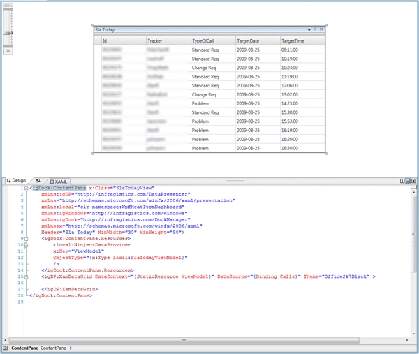

You have probably heard me go on about Unity a couple of times:

- [My.Unity.Resolve(Of Ninja)](http://blog.hinshelwood.com/archive/2009/05/08/my.unity.resolveof-ninja.aspx)
- [Unity and ASP.NET](http://blog.hinshelwood.com/archive/2009/05/08/unity-and-asp.net.aspx)
- [Creating a Data Access layer using Unity](http://blog.hinshelwood.com/archive/2009/07/30/creating-a-data-access-layer-using-unity.aspx)

I have been using what is now [unity](http://www.codeplex.com/unity) since the good old days (sooo not true, WPF is the Windows Forms killer, and good riddance) of WindowsForms and CAB (Client Application Block), but now there is a lightweight alternative: [Ninject](http://ninject.org).

I decided on my latest project (a Wpf dashboard for HEAT ITSM) that I needed dependency injection. Whenever I start building a [MVVM](http://msdn.microsoft.com/en-us/magazine/dd419663.aspx) project I always end up needing some sort of dependency injection to keep everything nice and neat. It is only really needed once you get to a certain size and when you start wanting talk between [ViewModels](http://en.wikipedia.org/wiki/Model_View_ViewModel).

Anyway I was using a method of injecting my ViewModels into the Views using standard binding:

```
<igDock:ContentPane x:Class="SlaTodayView"
    xmlns:igDP="http://infragistics.com/DataPresenter"
    xmlns="http://schemas.microsoft.com/winfx/2006/xaml/presentation"
    xmlns:local="clr-namespace:WpfHeatItsmDashboard"
    xmlns:igWindows="http://infragistics.com/Windows"
    xmlns:igDock="http://infragistics.com/DockManager"
    xmlns:x="http://schemas.microsoft.com/winfx/2006/xaml"
    Header="Sla Today" MinWidth="30" MinHeight="50">
    <igDock:ContentPane.Resources>
        <ObjectDataProvider
        x:Key="ViewModel"
        ObjectType="{x:Type local:SlaTodayViewModel}"
        />
    </igDock:ContentPane.Resources>
    <igDP:XamDataGrid DataContext="{StaticResource ViewModel}" DataSource="{Binding Calls}" Theme="Office2k7Black" >

    </igDP:XamDataGrid>
</igDock:ContentPane>
```

But once you move to dependency injection you do not want to keep all those fixed object definitions. These may become interfaces, or you may just want to replace, or dynamically replace, one of these types by a derived one at runtime.

That being the goal, we need some way to retrieve that type even in design mode. There is nothing worse than components or bits of components that make it difficult to work in both Visual Studio and Blend, and with the new binding features of Visual Studio 2010 for WPF 4 it will be even more important that your usage is as compatible as possible.

What I decided to do was create a custom [DataSourceProvider,](http://msdn.microsoft.com/en-us/library/system.windows.data.datasourceprovider.aspx) called the NinjectDataProvider that I could use instead of the ObjectDataProvider. This is the first version of that provider and it does nothing more than retrieve the type form the [Ninject](http://ninject.org) Kernel. Minimal changes to the WPF enable this:

```
<igDock:ContentPane x:Class="SlaTodayView"
    xmlns:igDP="http://infragistics.com/DataPresenter"
    xmlns="http://schemas.microsoft.com/winfx/2006/xaml/presentation"
    xmlns:local="clr-namespace:WpfHeatItsmDashboard"
    xmlns:igWindows="http://infragistics.com/Windows"
    xmlns:igDock="http://infragistics.com/DockManager"
    xmlns:x="http://schemas.microsoft.com/winfx/2006/xaml"
    Header="Sla Today" MinWidth="30" MinHeight="50">
    <igDock:ContentPane.Resources>
        <local:NinjectDataProvider
        x:Key="ViewModel"
        ObjectType="{x:Type local:SlaTodayViewModel}"
        />
    </igDock:ContentPane.Resources>
    <igDP:XamDataGrid DataContext="{StaticResource ViewModel}" DataSource="{Binding Calls}" Theme="Office2k7Black" >

    </igDP:XamDataGrid>
</igDock:ContentPane>
```

As you can see, the only difference is highlighted above and shows the custom [DataSourceProvider](http://msdn.microsoft.com/en-us/library/system.windows.data.datasourceprovider.aspx) in action.

  You can see from the image above that the designer capability is not affected with this actually loading from the database, nice!
{ .post-img }

So, what do we need to do to achieve this marvellous result. its actialy fairly simple, I got out my trusty [reflector](http://www.red-gate.com/products/reflector/) and found that there is really only one method to override.

```
Imports System.ComponentModel
Imports System.Threading

Public Class NinjectDataProvider
    Inherits DataSourceProvider

    Private m_objectType As Type

    Public Property ObjectType() As Type
        Get
            Return Me.m_objectType
        End Get
        Set(ByVal value As Type)
            If Not m_objectType Is value Then
                m_objectType = value
                Me.OnPropertyChanged("ObjectType")
                If Not MyBase.IsRefreshDeferred Then
                    MyBase.Refresh()
                End If
            End If
        End Set
    End Property

    Private Overloads Sub OnPropertyChanged(ByVal propertyName As String)
        MyBase.OnPropertyChanged(New PropertyChangedEventArgs(propertyName))
    End Sub

    Protected Overrides Sub BeginQuery()
        If m_objectType Is Nothing Then
            Me.OnQueryFinished(Nothing, New InvalidOperationException("You must provide an ObjectType"), Nothing, Nothing)
        End If
        Dim result As Object
        Try
            result = Application.NinjectKernel.Get(m_objectType)
            Me.OnQueryFinished(result, Nothing, Nothing, Nothing)
        Catch ex As Exception
            Me.OnQueryFinished(Nothing, ex, Nothing, Nothing)
        End Try
    End Sub

End Class
```

I do not yet need all the fancy features of [Ninject](http://ninject.org) yet so I have only implemented the bit that I need at the moment. If I am adding more (and get it working) I will blog about it in the future.

To get this working I needed to add an instance of an IKernel object to the “Application” file so I have a single Kernel instance through my application unless I want another, but this is a small price to pay and it could well have been done in the same way as the [My.Unity.Resolve(Of Ninja)](http://blog.hinshelwood.com/archive/2009/05/08/my.unity.resolveof-ninja.aspx) post I did on [Unity](http://www.codeplex.com/unity).

Start your [Ninja training](http://dojo.ninject.org/) today!

Technorati Tags: [.NET](http://technorati.com/tags/.NET) [CodeProject](http://technorati.com/tags/CodeProject) [MVVM](http://technorati.com/tags/MVVM) [WPF](http://technorati.com/tags/WPF) [VS 2010](http://technorati.com/tags/VS+2010)
