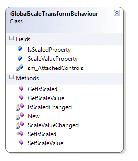
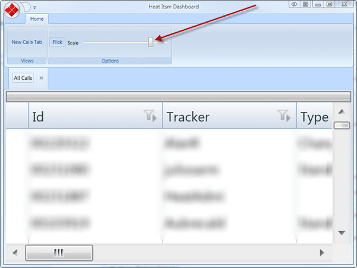

Although this post is called Scale Transform Behaviour you could use any transform / animation in its place. The purpose is to have a slider control in a menu be able to alter the scale of any number of controls within [MVVM](http://joshsmithonwpf.wordpress.com/2008/12/01/the-philosophies-of-mvvm/) views.


{ .post-img }

This behaviour allows you to add any Framework Elements to a list of attached controls by adding an attached property of GlobalScaleTransformBehaviour.IsScaled to your controls.

```
Public Class GlobalScaleTransformBehaviour

    Private Shared sm_AttachedControls As List(Of FrameworkElement)
    Public Shared ReadOnly IsScaledProperty As DependencyProperty = DependencyProperty.RegisterAttached("IsScaled", GetType(Boolean), GetType(GlobalScaleTransformBehaviour), New UIPropertyMetadata(False, New PropertyChangedCallback(AddressOf GlobalScaleTransformBehaviour.IsScaledChanged)))
    Private Shared sm_CurrentScale As Double = 1

    Shared Sub New()
        sm_AttachedControls = New List(Of FrameworkElement)
    End Sub

    Public Shared Function GetIsScaled(ByVal element As DependencyObject) As Boolean
        If element Is Nothing Then
            Throw New ArgumentNullException("element")
        End If

        Return element.GetValue(IsScaledProperty)
    End Function

    Public Shared Sub SetIsScaled(ByVal element As DependencyObject, ByVal value As Boolean)
        If element Is Nothing Then
            Throw New ArgumentNullException("element")
        End If
        element.SetValue(IsScaledProperty, value)
    End Sub

    Private Shared Sub IsScaledChanged(ByVal obj As DependencyObject, ByVal e As DependencyPropertyChangedEventArgs)
        Dim itemToResize As FrameworkElement = TryCast(obj, FrameworkElement)
        If (Not itemToResize Is Nothing) Then
            If Object.Equals(e.NewValue, True) Then
                sm_AttachedControls.Add(itemToResize)
                itemToResize.LayoutTransform = New ScaleTransform(sm_CurrentScale, sm_CurrentScale)
            Else
                sm_AttachedControls.Remove(itemToResize)
                itemToResize.LayoutTransform = New ScaleTransform(1, 1)
            End If
        End If
    End Sub

End Class
```

As you can see, there is an attached dependency Boolean property defined with a PropertyChangedCallback. When the PropertyChangedCallback method is called we test to see if it is a True or False value and either add the control to a static list and set the current Transform, or remove the control from the list and reset the transform to 1.

This works grate and you can manipulate the list of controls at runtime by changing the dependency property.

```
<igWindows:TabItemEx
    xmlns:igDP="http://infragistics.com/DataPresenter"
    xmlns="http://schemas.microsoft.com/winfx/2006/xaml/presentation"
    xmlns:local="clr-namespace:Hinshlabs.WpfHeatItsmDashboard"
    xmlns:igWindows="http://infragistics.com/Windows"
    xmlns:igDock="http://infragistics.com/DockManager"
    xmlns:x="http://schemas.microsoft.com/winfx/2006/xaml"
    xmlns:d="http://schemas.microsoft.com/expression/blend/2008"
    xmlns:mc="http://schemas.openxmlformats.org/markup-compatibility/2006"
    xmlns:diag="clr-namespace:System.Diagnostics;assembly=WindowsBase"
    mc:Ignorable="d"
    xmlns:igEditors="http://infragistics.com/Editors"
    xmlns:i="clr-namespace:System.Windows.Interactivity;assembly=System.Windows.Interactivity"
    xmlns:ic="clr-namespace:Microsoft.Expression.Interactivity.Core;assembly=Microsoft.Expression.Interactions"
    x:Class="CallsView" x:Name="CallsView" MinWidth="30" MinHeight="50">
    <igWindows:TabItemEx.Resources>
        <local:NinjectDataProvider
        x:Key="ViewModel"
        d:IsDataSource="True" ObjectType="{x:Type local:CallsViewModel}"
        />
       <local:DateTimeSecondsToBooleanConverter x:Key="DateTimeSecondsToBooleanConverter" />
    </igWindows:TabItemEx.Resources>
    <igWindows:TabItemEx.Triggers>
        <EventTrigger RoutedEvent="FrameworkElement.Loaded"/>
    </igWindows:TabItemEx.Triggers>
    <igWindows:TabItemEx.Header>
        <igEditors:XamTextEditor Text="{Binding Source={StaticResource ViewModel},Path=Header, diag:PresentationTraceSources.TraceLevel=High}" />
    </igWindows:TabItemEx.Header>

    <DockPanel local:GlobalScaleTransformBehaviour.IsScaled="True" DataContext="{Binding Source={StaticResource ViewModel}}">
        <Border DockPanel.Dock="Top" Background="LightGray" MinHeight="20">
        <Border.Style>
            <Style>
                <Style.Triggers>
                  <DataTrigger Binding="{Binding Source={StaticResource ViewModel},Path=IsLoading, diag:PresentationTraceSources.TraceLevel=High}" Value="False">
                           <Setter Property="Border.Visibility" Value="Collapsed" />
                  </DataTrigger>
                    </Style.Triggers>
            </Style>
        </Border.Style>
            <Label Content="Loading data..." />
        </Border>
        <Border DockPanel.Dock="Top" Background="LightGray" MinHeight="20">
            <Border.Style>
                <Style>
                    <Style.Triggers>
                        <DataTrigger Binding="{Binding Source={StaticResource ViewModel},Path=IsSyncing, diag:PresentationTraceSources.TraceLevel=High}" Value="False">
                            <Setter Property="Border.Visibility" Value="Collapsed" />
                        </DataTrigger>
                    </Style.Triggers>
                </Style>
            </Border.Style>
            <Label Content="Syncing data..." />
        </Border>
        <igDP:XamDataGrid DataSource="{Binding Calls}" Theme="Office2k7Blue">
            <igDP:XamDataGrid.Resources>
                <Style x:Key="{x:Type igDP:DataRecordCellArea}" TargetType="{x:Type igDP:DataRecordCellArea}">
                <Style.Triggers>
                    <DataTrigger Binding="{Binding DataItem.TypeOfCall, Converter={StaticResource DateTimeSecondsToBooleanConverter}, ConverterParameter=1}" Value="True">
                            <Setter Property="Background">
                                <Setter.Value>
                                    <LinearGradientBrush StartPoint="0,0" EndPoint="0,1">
                                        <LinearGradientBrush.GradientStops>
                                            <GradientStopCollection>
                                                <GradientStop Offset="0" Color="Red"/>
                                                <GradientStop Offset="1" Color="Green"/>
                                            </GradientStopCollection>
                                        </LinearGradientBrush.GradientStops>
                                    </LinearGradientBrush>
                                </Setter.Value>
                            </Setter>
                        </DataTrigger>
                </Style.Triggers>
            </Style>
                </igDP:XamDataGrid.Resources>
            <igDP:XamDataGrid.FieldSettings>
                <igDP:FieldSettings AllowRecordFiltering="true" FilterEvaluationTrigger="OnCellValueChange"  AllowSummaries="True" FilterOperatorDropDownItems="All" />
            </igDP:XamDataGrid.FieldSettings>
            <igDP:XamDataGrid.FieldLayoutSettings>
                <igDP:FieldLayoutSettings AutoGenerateFields="true" FilterUIType="LabelIcons" />
            </igDP:XamDataGrid.FieldLayoutSettings>
        </igDP:XamDataGrid>
        </DockPanel>
</igWindows:TabItemEx>
```

There is quite a lot of Wpf here, so I have highlighted the DockPanel to which the dependency has been applied. All we now need to do is provide a way to manipulate this value. We need to add a ScaleValue attached dependency property to our Behaviour that we can bind to our single or set of control controls.

```
Public Class GlobalScaleTransformBehaviour

    Private Shared sm_AttachedControls As List(Of FrameworkElement)
    Public Shared ReadOnly IsScaledProperty As DependencyProperty = DependencyProperty.RegisterAttached("IsScaled", GetType(Boolean), GetType(GlobalScaleTransformBehaviour), New UIPropertyMetadata(False, New PropertyChangedCallback(AddressOf GlobalScaleTransformBehaviour.IsScaledChanged)))
    Public Shared ReadOnly ScaleValueProperty As DependencyProperty = DependencyProperty.RegisterAttached("ScaleValue", GetType(Double), GetType(GlobalScaleTransformBehaviour), New UIPropertyMetadata(CType(1, Double), New PropertyChangedCallback(AddressOf GlobalScaleTransformBehaviour.ScaleValueChanged)))
    Private Shared sm_CurrentScale As Double = 1

    Shared Sub New()
        sm_AttachedControls = New List(Of FrameworkElement)
    End Sub

    Public Shared Function GetIsScaled(ByVal element As DependencyObject) As Boolean
        If element Is Nothing Then
            Throw New ArgumentNullException("element")
        End If

        Return element.GetValue(IsScaledProperty)
    End Function

    Public Shared Sub SetIsScaled(ByVal element As DependencyObject, ByVal value As Boolean)
        If element Is Nothing Then
            Throw New ArgumentNullException("element")
        End If
        element.SetValue(IsScaledProperty, value)
    End Sub

    Private Shared Sub IsScaledChanged(ByVal obj As DependencyObject, ByVal e As DependencyPropertyChangedEventArgs)
        Dim itemToResize As FrameworkElement = TryCast(obj, FrameworkElement)
        If (Not itemToResize Is Nothing) Then
            If Object.Equals(e.NewValue, True) Then
                sm_AttachedControls.Add(itemToResize)
                itemToResize.LayoutTransform = New ScaleTransform(sm_CurrentScale, sm_CurrentScale)
            Else
                sm_AttachedControls.Remove(itemToResize)
                itemToResize.LayoutTransform = New ScaleTransform(1, 1)
            End If
        End If
    End Sub

    Public Shared Function GetScaleValue(ByVal element As DependencyObject) As Double
        If element Is Nothing Then
            Throw New ArgumentNullException("element")
        End If

        Return element.GetValue(ScaleValueProperty)
    End Function

    Public Shared Sub SetScaleValue(ByVal element As DependencyObject, ByVal value As Double)
        If element Is Nothing Then
            Throw New ArgumentNullException("element")
        End If
        element.SetValue(ScaleValueProperty, value)
    End Sub

    Private Shared Sub ScaleValueChanged(ByVal obj As DependencyObject, ByVal e As DependencyPropertyChangedEventArgs)
        If Not Application.Current.Dispatcher.CheckAccess Then
            Exit Sub
        End If
        sm_CurrentScale = e.NewValue
        SyncLock sm_AttachedControls
            For Each itemToResize In sm_AttachedControls.ToList
                ' Apply Tensform
                itemToResize.LayoutTransform = New ScaleTransform(sm_CurrentScale, sm_CurrentScale)
            Next
        End SyncLock
    End Sub

End Class
```

This value is stored so we can set new controls, and then applied to all of the currently attached controls. I have chosen to bind to a slider, but any way of passing in the required values is just fine.

```
<igRibbon:XamRibbonWindow x:Class="MainWindowView"
    xmlns="http://schemas.microsoft.com/winfx/2006/xaml/presentation"
    xmlns:x="http://schemas.microsoft.com/winfx/2006/xaml"
    xmlns:igRibbon="http://infragistics.com/Ribbon"
    xmlns:igEditors="http://infragistics.com/Editors"
    xmlns:igWindows="http://infragistics.com/Windows"
    xmlns:igDock="http://infragistics.com/DockManager"
    xmlns:local="clr-namespace:Hinshlabs.WpfHeatItsmDashboard"
    Title="Heat Itsm Dashboard" MinHeight="600" MinWidth="800" Icon="/Hinshlabs.WpfHeatItsmDashboard;component/HeatItsm.ico">
    <igRibbon:XamRibbonWindow.Resources>
        <local:NinjectDataProvider
        x:Key="ViewModel"
        ObjectType="{x:Type local:MainWindowViewModel}"
        />
    </igRibbon:XamRibbonWindow.Resources>
    <igRibbon:RibbonWindowContentHost DataContext="{StaticResource ViewModel}">
        <igRibbon:RibbonWindowContentHost.Ribbon>
            <igRibbon:XamRibbon local:XamRibbonBehaviour.IsEntryPoint="True" DockPanel.Dock="Top" AutoHideEnabled="True" Theme="Office2k7Blue" >
            <igRibbon:XamRibbon.ApplicationMenu>
                    <igRibbon:ApplicationMenu RecentItemsHeader="{Binding Resources.RecentItemsHeader}" Image="/Hinshlabs.WpfHeatItsmDashboard;component/Images/heat.gif">
                        <igRibbon:ButtonTool Caption="Update" />
                    <igRibbon:ApplicationMenu.FooterToolbar>
                        <igRibbon:ApplicationMenuFooterToolbar>
                            <igRibbon:ButtonTool Command="{Binding ExitCommand}" Caption="{Binding Resources.ExitButtonCaption}"/>
                        </igRibbon:ApplicationMenuFooterToolbar>
                    </igRibbon:ApplicationMenu.FooterToolbar>
                        </igRibbon:ApplicationMenu>
                </igRibbon:XamRibbon.ApplicationMenu>
                <igRibbon:XamRibbon.Tabs>
                    <igRibbon:RibbonTabItem Header="{Binding Resources.Ribbon_HomeTab_Header}">
                        <igRibbon:RibbonGroup Caption="{Binding Resources.Ribbon_HomeTab_ViewsGroup_Caption}">
                            <igRibbon:ToolHorizontalWrapPanel>
                                <igRibbon:ButtonTool Caption="{Binding Resources.Ribbon_HomeTab_ViewsGroup_CallsViewButtonCaption}" Command="{Binding AddCallsViewCommand}" />
                            </igRibbon:ToolHorizontalWrapPanel>
                        </igRibbon:RibbonGroup>
                        <igRibbon:RibbonGroup Caption="{Binding Resources.Ribbon_HomeTab_OptionsGroup_Caption}">
                                    <igRibbon:ToolHorizontalWrapPanel>
                                    <igRibbon:ButtonGroup>
                                        <igRibbon:ToggleButtonTool IsChecked="{Binding FickEnabled, Mode=TwoWay}" Content="{Binding Resources.Ribbon_HomeTab_OptionsGroup_Flick_ToggleButton_Caption}"/>
                                </igRibbon:ButtonGroup>
                                    </igRibbon:ToolHorizontalWrapPanel>
                            <igRibbon:ToolHorizontalWrapPanel>
                                <igRibbon:ButtonGroup>
                                    <Label Content="Scale" />
                                    <Slider Minimum="0.5" Maximum="3" Width="200" local:GlobalScaleTransformBehaviour.ScaleValue="1" LargeChange=".5" SmallChange=".1"  Value="{Binding Path=(local:GlobalScaleTransformBehaviour.ScaleValue),RelativeSource={RelativeSource Self}, Mode=TwoWay}">
                                    </Slider>
                                </igRibbon:ButtonGroup>
                            </igRibbon:ToolHorizontalWrapPanel>
                        </igRibbon:RibbonGroup>
                    </igRibbon:RibbonTabItem>
                </igRibbon:XamRibbon.Tabs>
            </igRibbon:XamRibbon>
    </igRibbon:RibbonWindowContentHost.Ribbon>
        <AdornerDecorator>
        <DockPanel>
            <local:UpdateView DockPanel.Dock="Top" />
            <igWindows:XamTabControl TabItemCloseButtonVisibility="Visible" TabStripPlacement="Top" ItemsSource="{Binding CallsViews}" SelectedItem="{Binding SelectedCallsView}" local:TabControlTimedBehaviour.IsTimedCycle="{Binding FickEnabled}" Theme="Office2k7Blue">
            </igWindows:XamTabControl>
        </DockPanel>
        </AdornerDecorator>
    </igRibbon:RibbonWindowContentHost>
</igRibbon:XamRibbonWindow>
```


{ .post-img }

As you can see I am heavily utilizing the Infragistics controls, but that would not affect this procedure. The result is the ability to smoothly scale your controls based on a global scale setting.


{ .post-img }

krsu46zvpt

Technorati Tags: [.NET](http://technorati.com/tags/.NET) [WPF](http://technorati.com/tags/WPF) [CodeProject](http://technorati.com/tags/CodeProject) [MVVM](http://technorati.com/tags/MVVM)
